# PromSNMP Cloud Manager Architecture

A centralized cloud service for managing a fleet of PromSNMP instances across multiple sites with real-time synchronization, leader election, and fleet-wide visibility.

---

## Overview

The Cloud Manager replaces traditional shared filesystem approaches (NFS/EFS) with a purpose-built API that serves as the single source of truth for device inventory, discovery configuration, and instance coordination.

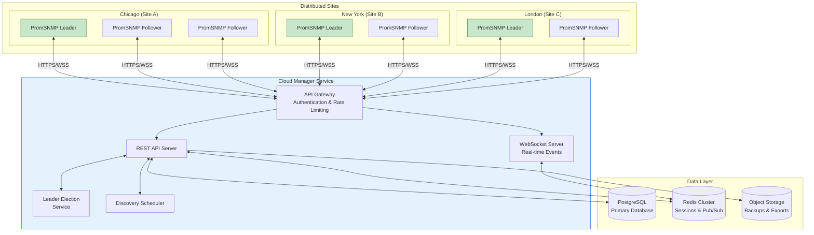

---

## Core Concepts

### Hierarchy

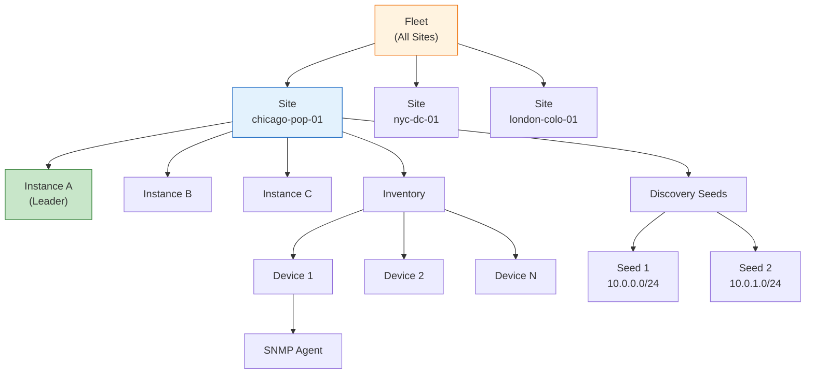

| Entity | Description |
|--------|-------------|
| **Fleet** | The entire collection of sites under management |
| **Site** | A physical or logical location with PromSNMP instances |
| **Instance** | A single PromSNMP container/process |
| **Inventory** | Collection of discovered network devices for a site |
| **Device** | A network device (router, switch, etc.) with SNMP agent(s) |
| **Discovery Seed** | Configuration for scanning a network range |

### Leader Election

Each site has exactly one leader instance responsible for:
- Running SNMP discovery scans
- Reporting new devices to the Cloud Manager
- Receiving discovery seed configurations

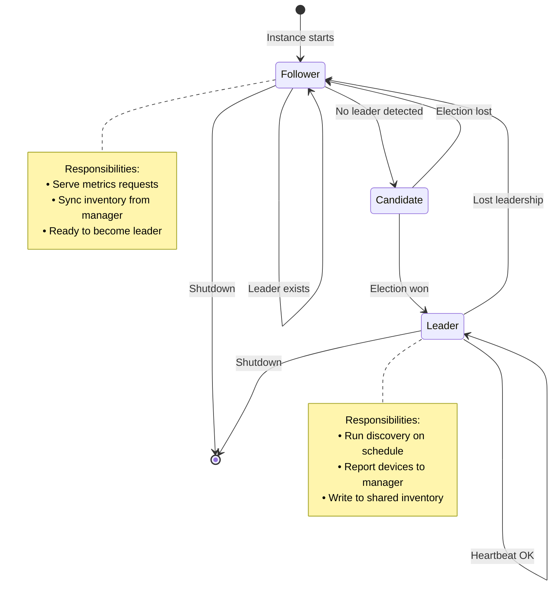

---

## Instance Lifecycle

### Registration & Startup

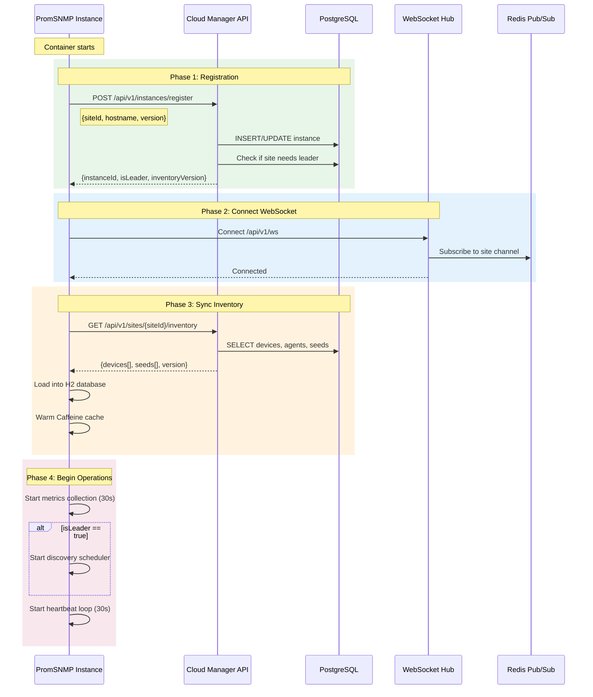

### Heartbeat & Health Monitoring

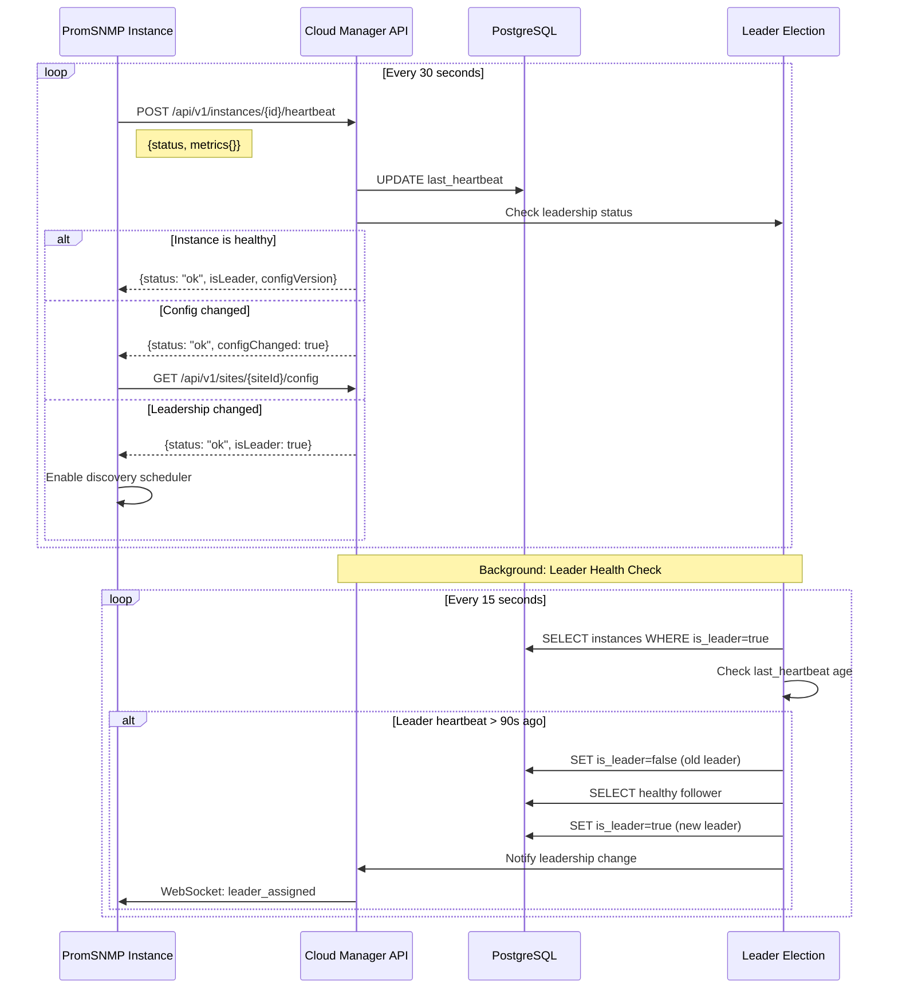

### Discovery Flow

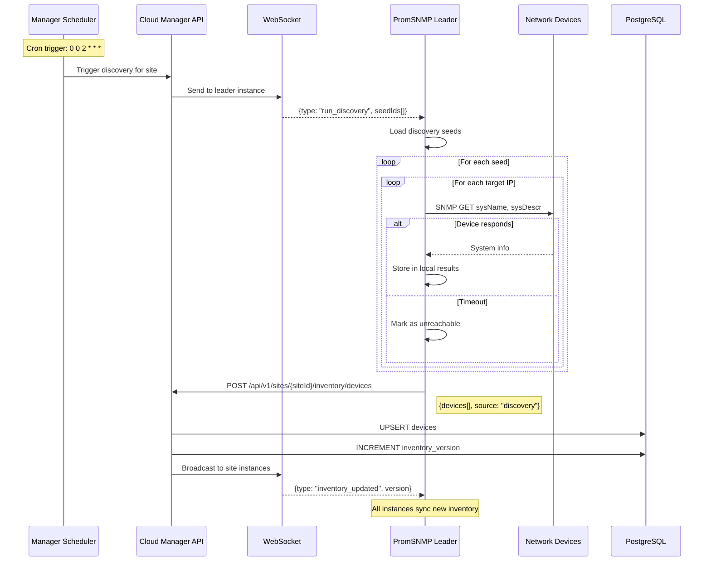

### Graceful Shutdown

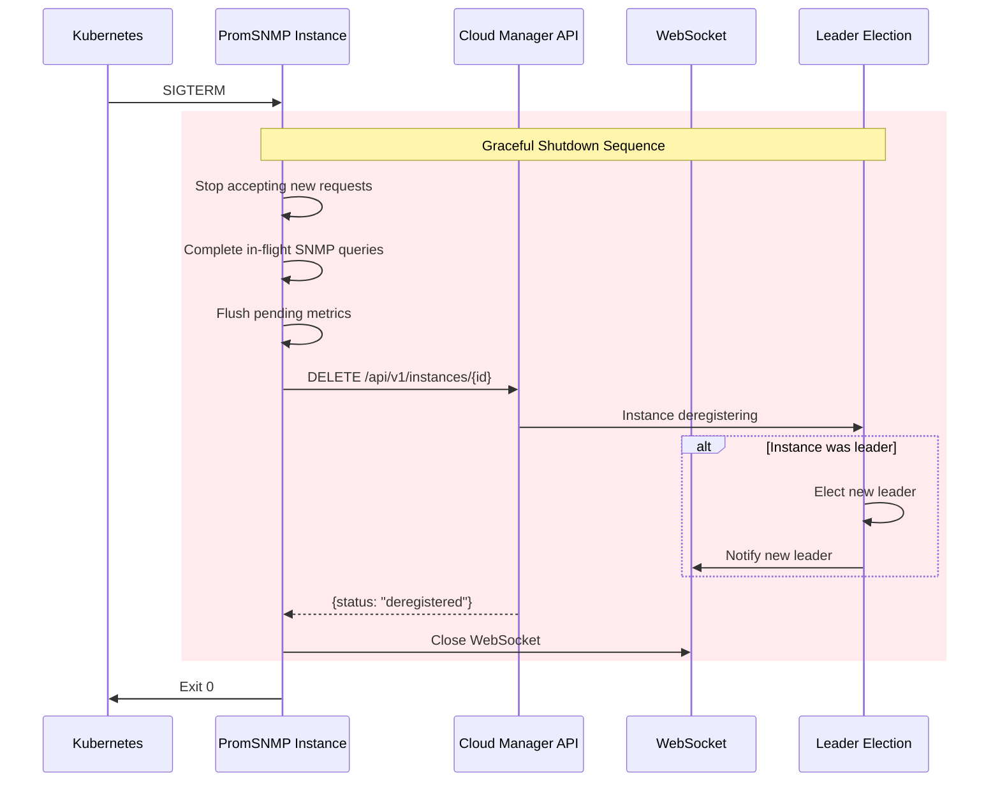

---

## API Reference

### Authentication

All requests require a Bearer token in the Authorization header:

```
Authorization: Bearer <api-token>
```

**Token Scopes:**

| Scope | Permissions |
|-------|-------------|
| `read` | GET endpoints only |
| `write` | GET, POST, PUT, DELETE |
| `admin` | All operations + credential access |
| `instance` | Instance-specific operations (register, heartbeat) |

### Endpoints Overview

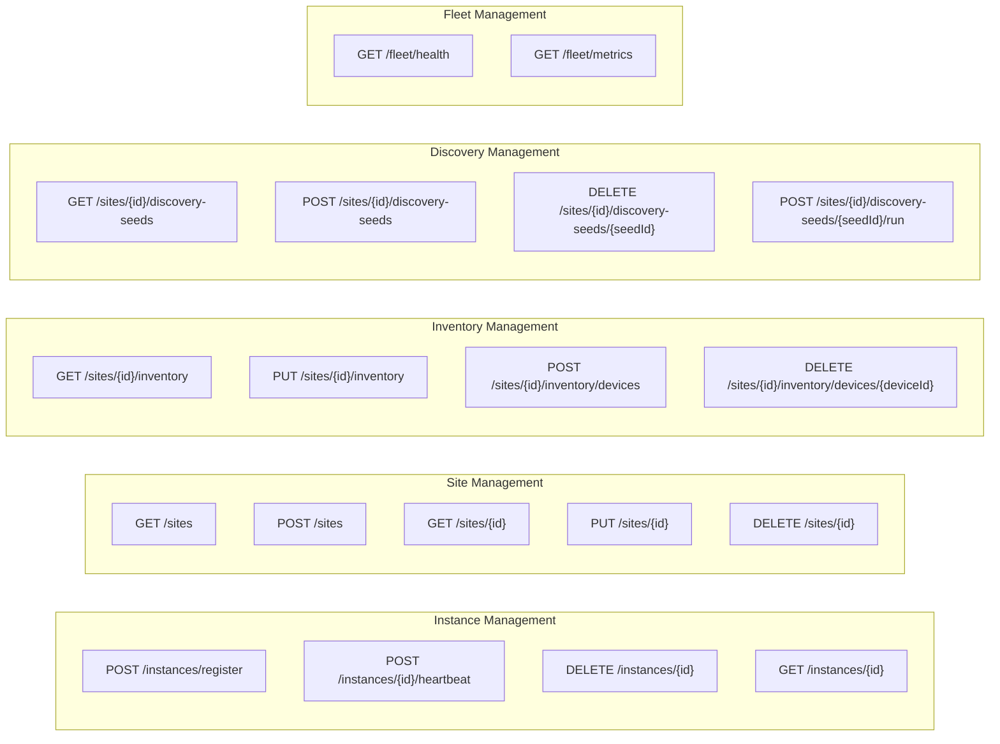

### Instance Endpoints

#### Register Instance

```http
POST /api/v1/instances/register
Content-Type: application/json
Authorization: Bearer <instance-token>

{
  "siteId": "chicago-pop-01",
  "hostname": "promsnmp-7f8d9c",
  "version": "0.0.10",
  "podName": "promsnmp-deployment-7f8d9c-abc12",
  "capabilities": ["snmpv1", "snmpv2c", "snmpv3"],
  "labels": {
    "environment": "production",
    "region": "us-central"
  }
}
```

**Response:**

```json
{
  "instanceId": "inst_abc123def456",
  "siteId": "chicago-pop-01",
  "isLeader": false,
  "inventoryVersion": 42,
  "configVersion": 5,
  "config": {
    "discoveryEnabled": true,
    "discoveryCron": "0 0 2 * * *",
    "discoveryTimezone": "America/Chicago",
    "collectionInterval": 30000,
    "cacheExpiration": 300000,
    "cacheMaxEntries": 10000
  },
  "websocketUrl": "wss://manager.example.com/api/v1/ws"
}
```

#### Heartbeat

```http
POST /api/v1/instances/{instanceId}/heartbeat
Content-Type: application/json

{
  "status": "healthy",
  "uptime": 86400,
  "inventoryVersion": 42,
  "metrics": {
    "devicesMonitored": 150,
    "cacheHitRate": 0.94,
    "cacheSize": 8500,
    "snmpQueriesTotal": 45000,
    "snmpQueriesPerMinute": 312,
    "snmpErrorRate": 0.02,
    "activeConnections": 3,
    "memoryUsedMb": 512,
    "cpuPercent": 15.5
  }
}
```

**Response:**

```json
{
  "status": "ok",
  "isLeader": true,
  "inventoryVersion": 42,
  "configVersion": 5,
  "configChanged": false,
  "serverTime": "2024-01-15T10:30:00Z"
}
```

#### Deregister Instance

```http
DELETE /api/v1/instances/{instanceId}
```

**Response:**

```json
{
  "status": "deregistered",
  "wasLeader": true,
  "newLeader": "inst_xyz789"
}
```

### Site Endpoints

#### List Sites

```http
GET /api/v1/sites
```

**Response:**

```json
{
  "sites": [
    {
      "id": "chicago-pop-01",
      "label": "Chicago POP",
      "description": "Primary aggregation point",
      "location": {
        "address": "350 E Cermak Rd, Chicago, IL",
        "latitude": 41.853742,
        "longitude": -87.618805
      },
      "status": "healthy",
      "instanceCount": 3,
      "healthyInstances": 3,
      "leaderInstanceId": "inst_abc123",
      "deviceCount": 150,
      "lastDiscovery": "2024-01-15T02:00:00Z",
      "createdAt": "2024-01-01T00:00:00Z"
    }
  ],
  "total": 3
}
```

#### Create Site

```http
POST /api/v1/sites
Content-Type: application/json

{
  "id": "london-colo-01",
  "label": "London Colocation",
  "description": "EMEA regional hub",
  "location": {
    "address": "London, UK",
    "latitude": 51.5074,
    "longitude": -0.1278
  },
  "config": {
    "timezone": "Europe/London",
    "minReplicas": 2,
    "discoveryEnabled": true,
    "discoveryCron": "0 0 3 * * *"
  }
}
```

#### Get Site Details

```http
GET /api/v1/sites/{siteId}
```

**Response:**

```json
{
  "id": "chicago-pop-01",
  "label": "Chicago POP",
  "description": "Primary aggregation point",
  "location": {
    "address": "350 E Cermak Rd, Chicago, IL",
    "latitude": 41.853742,
    "longitude": -87.618805
  },
  "config": {
    "timezone": "America/Chicago",
    "minReplicas": 3,
    "discoveryEnabled": true,
    "discoveryCron": "0 0 2 * * *",
    "collectionInterval": 30000,
    "cacheExpiration": 300000
  },
  "status": "healthy",
  "instances": [
    {
      "id": "inst_abc123",
      "hostname": "promsnmp-7f8d9c",
      "isLeader": true,
      "status": "healthy",
      "lastHeartbeat": "2024-01-15T10:29:30Z",
      "version": "0.0.10"
    },
    {
      "id": "inst_def456",
      "hostname": "promsnmp-2e4f6a",
      "isLeader": false,
      "status": "healthy",
      "lastHeartbeat": "2024-01-15T10:29:25Z",
      "version": "0.0.10"
    }
  ],
  "stats": {
    "deviceCount": 150,
    "agentCount": 165,
    "seedCount": 5,
    "lastDiscovery": "2024-01-15T02:00:00Z",
    "inventoryVersion": 42
  }
}
```

### Inventory Endpoints

#### Get Site Inventory

```http
GET /api/v1/sites/{siteId}/inventory?version=41&includeCredentials=false
```

**Query Parameters:**

| Parameter | Type | Description |
|-----------|------|-------------|
| `version` | int | Only return if newer than this version (conditional fetch) |
| `includeCredentials` | bool | Include SNMP credentials (requires admin scope) |
| `deviceIds` | string[] | Filter to specific devices |

**Response:**

```json
{
  "version": 42,
  "updatedAt": "2024-01-15T02:15:00Z",
  "devices": [
    {
      "id": "dev_abc123",
      "sysName": "core-rtr-01.chicago",
      "sysDescr": "Cisco IOS XR Software, Version 7.3.2",
      "sysContact": "noc@example.com",
      "sysLocation": "Chicago POP, Rack A1",
      "sysObjectId": "1.3.6.1.4.1.9.1.2066",
      "agents": [
        {
          "id": "agt_111",
          "address": "10.0.1.1",
          "port": 161,
          "version": 2,
          "type": "community",
          "readCommunity": "****",
          "isPrimary": true
        }
      ],
      "interfaces": 48,
      "discoveredAt": "2024-01-10T08:00:00Z",
      "lastSeen": "2024-01-15T10:25:00Z",
      "discoveredBy": "inst_abc123",
      "metadata": {
        "vendor": "cisco",
        "model": "ASR-9001",
        "role": "core-router"
      }
    }
  ],
  "discoverySeeds": [
    {
      "id": "seed_001",
      "name": "Core Network",
      "targets": ["10.0.1.0/24", "10.0.2.0/24"],
      "snmpConfig": {
        "version": 2,
        "readCommunity": "****"
      },
      "schedule": "0 0 2 * * *",
      "enabled": true,
      "lastRun": "2024-01-15T02:00:00Z",
      "lastRunStatus": "success",
      "devicesFound": 45
    }
  ]
}
```

#### Add Devices (Discovery Results)

```http
POST /api/v1/sites/{siteId}/inventory/devices
Content-Type: application/json

{
  "devices": [
    {
      "sysName": "access-sw-15.chicago",
      "sysDescr": "Cisco Catalyst 9300",
      "sysContact": "noc@example.com",
      "sysLocation": "Chicago POP, Rack B3",
      "agents": [
        {
          "address": "10.0.3.15",
          "port": 161,
          "version": 2,
          "type": "community",
          "readCommunity": "public123"
        }
      ],
      "metadata": {
        "vendor": "cisco",
        "discoverySource": "seed_001"
      }
    }
  ],
  "source": "discovery",
  "instanceId": "inst_abc123",
  "seedId": "seed_001"
}
```

**Response:**

```json
{
  "added": 1,
  "updated": 0,
  "unchanged": 0,
  "failed": 0,
  "newVersion": 43,
  "devices": [
    {
      "id": "dev_xyz789",
      "sysName": "access-sw-15.chicago",
      "status": "added"
    }
  ]
}
```

#### Bulk Import Inventory

```http
PUT /api/v1/sites/{siteId}/inventory
Content-Type: application/json

{
  "devices": [...],
  "discoverySeeds": [...],
  "mode": "merge"
}
```

**Mode Options:**

| Mode | Behavior |
|------|----------|
| `merge` | Add new, update existing, keep others |
| `replace` | Replace all devices and seeds |
| `addOnly` | Only add new, don't update existing |

#### Delete Device

```http
DELETE /api/v1/sites/{siteId}/inventory/devices/{deviceId}
```

### Discovery Seed Endpoints

#### List Discovery Seeds

```http
GET /api/v1/sites/{siteId}/discovery-seeds
```

#### Create Discovery Seed

```http
POST /api/v1/sites/{siteId}/discovery-seeds
Content-Type: application/json

{
  "name": "Distribution Layer",
  "targets": [
    "10.0.10.0/24",
    "10.0.11.0/24",
    "192.168.1.1",
    "192.168.1.2"
  ],
  "snmpConfig": {
    "version": 3,
    "securityName": "monitor",
    "securityLevel": "authPriv",
    "authProtocol": "SHA256",
    "authPassphrase": "authpass123",
    "privProtocol": "AES256",
    "privPassphrase": "privpass123"
  },
  "schedule": "0 0 2 * * *",
  "enabled": true,
  "options": {
    "timeout": 5000,
    "retries": 2,
    "maxConcurrent": 50
  }
}
```

#### Trigger Discovery

```http
POST /api/v1/sites/{siteId}/discovery-seeds/{seedId}/run
```

**Response:**

```json
{
  "status": "started",
  "runId": "run_abc123",
  "estimatedTargets": 512,
  "leaderInstance": "inst_abc123"
}
```

#### Get Discovery Run Status

```http
GET /api/v1/sites/{siteId}/discovery-runs/{runId}
```

**Response:**

```json
{
  "runId": "run_abc123",
  "seedId": "seed_001",
  "status": "completed",
  "startedAt": "2024-01-15T10:30:00Z",
  "completedAt": "2024-01-15T10:35:00Z",
  "targetsScanned": 512,
  "devicesFound": 45,
  "devicesNew": 3,
  "devicesUpdated": 42,
  "errors": 5
}
```

### Fleet Endpoints

#### Fleet Health

```http
GET /api/v1/fleet/health
```

**Response:**

```json
{
  "status": "healthy",
  "timestamp": "2024-01-15T10:30:00Z",
  "summary": {
    "totalSites": 3,
    "healthySites": 3,
    "degradedSites": 0,
    "offlineSites": 0,
    "totalInstances": 7,
    "healthyInstances": 7,
    "totalDevices": 450,
    "totalAgents": 495
  },
  "sites": [
    {
      "id": "chicago-pop-01",
      "status": "healthy",
      "instances": 3,
      "devices": 150
    },
    {
      "id": "nyc-dc-01",
      "status": "healthy",
      "instances": 2,
      "devices": 200
    },
    {
      "id": "london-colo-01",
      "status": "healthy",
      "instances": 2,
      "devices": 100
    }
  ],
  "alerts": []
}
```

#### Fleet Metrics

```http
GET /api/v1/fleet/metrics?format=prometheus
```

**Response (Prometheus format):**

```
# HELP promsnmp_fleet_sites_total Total number of sites
# TYPE promsnmp_fleet_sites_total gauge
promsnmp_fleet_sites_total 3

# HELP promsnmp_fleet_instances_total Total instances by status
# TYPE promsnmp_fleet_instances_total gauge
promsnmp_fleet_instances_total{status="healthy"} 7
promsnmp_fleet_instances_total{status="degraded"} 0
promsnmp_fleet_instances_total{status="offline"} 0

# HELP promsnmp_fleet_devices_total Total monitored devices
# TYPE promsnmp_fleet_devices_total gauge
promsnmp_fleet_devices_total 450

# HELP promsnmp_site_instances Site instance count
# TYPE promsnmp_site_instances gauge
promsnmp_site_instances{site="chicago-pop-01"} 3
promsnmp_site_instances{site="nyc-dc-01"} 2
promsnmp_site_instances{site="london-colo-01"} 2
```

---

## WebSocket Events

### Connection

```
WSS /api/v1/ws?instanceId={instanceId}&token={token}
```

### Event Format

All events follow this structure:

```json
{
  "type": "event_type",
  "timestamp": "2024-01-15T10:30:00Z",
  "siteId": "chicago-pop-01",
  "payload": { ... }
}
```

### Event Types

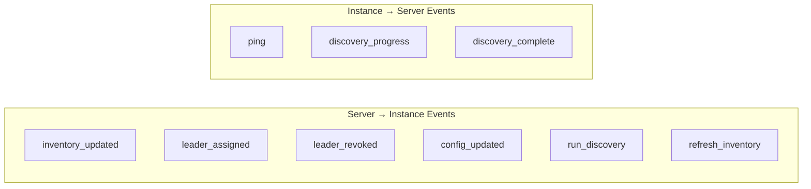

#### inventory_updated

Sent when the site inventory changes.

```json
{
  "type": "inventory_updated",
  "timestamp": "2024-01-15T10:30:00Z",
  "siteId": "chicago-pop-01",
  "payload": {
    "version": 43,
    "changeType": "device_added",
    "deviceIds": ["dev_xyz789"],
    "source": "discovery",
    "triggeredBy": "inst_abc123"
  }
}
```

**Change Types:** `device_added`, `device_updated`, `device_removed`, `bulk_import`, `full_sync`

#### leader_assigned

Sent to an instance when it becomes the site leader.

```json
{
  "type": "leader_assigned",
  "timestamp": "2024-01-15T10:30:00Z",
  "siteId": "chicago-pop-01",
  "payload": {
    "instanceId": "inst_def456",
    "previousLeader": "inst_abc123",
    "reason": "previous_leader_unhealthy"
  }
}
```

**Reasons:** `no_previous_leader`, `previous_leader_unhealthy`, `previous_leader_deregistered`, `manual_assignment`

#### leader_revoked

Sent to an instance when it loses leadership.

```json
{
  "type": "leader_revoked",
  "timestamp": "2024-01-15T10:30:00Z",
  "siteId": "chicago-pop-01",
  "payload": {
    "instanceId": "inst_abc123",
    "newLeader": "inst_def456",
    "reason": "health_check_failed"
  }
}
```

#### config_updated

Sent when site configuration changes.

```json
{
  "type": "config_updated",
  "timestamp": "2024-01-15T10:30:00Z",
  "siteId": "chicago-pop-01",
  "payload": {
    "configVersion": 6,
    "changes": ["discoveryCron", "collectionInterval"],
    "config": {
      "discoveryCron": "0 0 3 * * *",
      "collectionInterval": 60000
    }
  }
}
```

#### run_discovery

Sent to leader to trigger discovery.

```json
{
  "type": "run_discovery",
  "timestamp": "2024-01-15T10:30:00Z",
  "siteId": "chicago-pop-01",
  "payload": {
    "runId": "run_abc123",
    "seedIds": ["seed_001", "seed_002"],
    "triggeredBy": "scheduled"
  }
}
```

#### refresh_inventory

Force instance to re-fetch inventory.

```json
{
  "type": "refresh_inventory",
  "timestamp": "2024-01-15T10:30:00Z",
  "siteId": "chicago-pop-01",
  "payload": {
    "reason": "admin_request",
    "fullSync": true
  }
}
```

---

## Offline Operation & Resilience

### Connection States

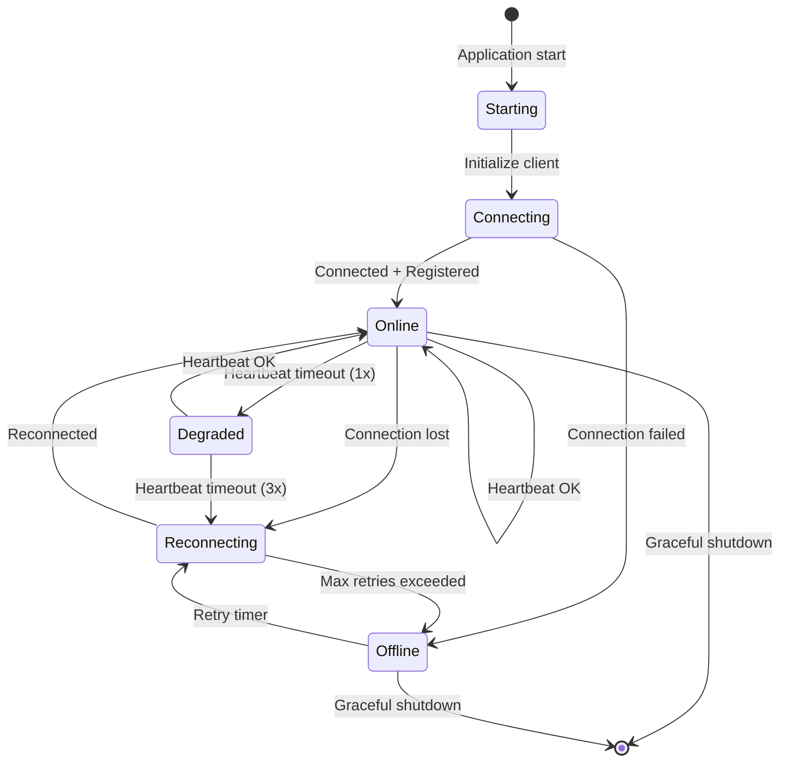

### Behavior by State

| State | Metrics Serving | Discovery | Inventory Sync | Heartbeat |
|-------|-----------------|-----------|----------------|-----------|
| **Online** | From cache/SNMP | Active (if leader) | Real-time | Every 30s |
| **Degraded** | From cache/SNMP | Paused | Paused | Retry |
| **Reconnecting** | From cache | Queued | Pending | Retry |
| **Offline** | From cache only | Queued locally | Manual only | Disabled |

### Reconnection Strategy

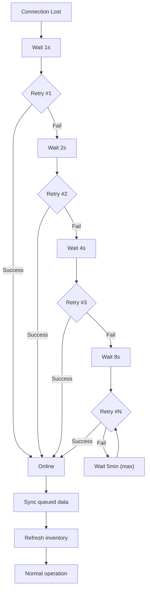

### Local Queue (Offline Mode)

When offline, the instance queues:
- Discovery results (if leader)
- Instance metrics for heartbeat
- Configuration acknowledgments

```json
{
  "queuedAt": "2024-01-15T10:30:00Z",
  "type": "discovery_results",
  "payload": {
    "devices": [...],
    "seedId": "seed_001"
  }
}
```

On reconnection, queued items are sent in order with deduplication.

---

## Database Schema

### Entity Relationship Diagram

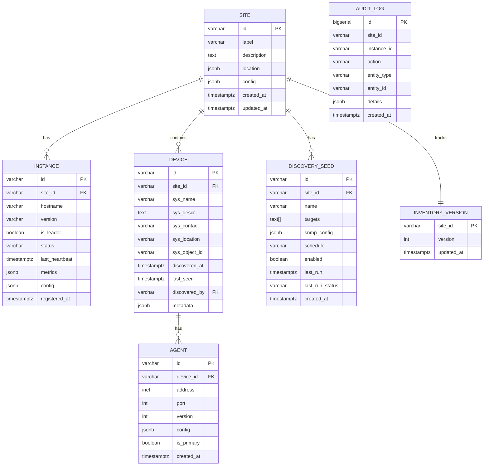

### SQL Schema

```sql
-- Enable UUID extension
CREATE EXTENSION IF NOT EXISTS "uuid-ossp";

-- Sites
CREATE TABLE sites (
    id VARCHAR(64) PRIMARY KEY,
    label VARCHAR(255) NOT NULL,
    description TEXT,
    location JSONB DEFAULT '{}',
    config JSONB DEFAULT '{}',
    created_at TIMESTAMPTZ DEFAULT NOW(),
    updated_at TIMESTAMPTZ DEFAULT NOW()
);

-- Instances
CREATE TABLE instances (
    id VARCHAR(64) PRIMARY KEY DEFAULT 'inst_' || uuid_generate_v4()::text,
    site_id VARCHAR(64) NOT NULL REFERENCES sites(id) ON DELETE CASCADE,
    hostname VARCHAR(255) NOT NULL,
    pod_name VARCHAR(255),
    version VARCHAR(32),
    is_leader BOOLEAN DEFAULT FALSE,
    status VARCHAR(32) DEFAULT 'unknown',
    last_heartbeat TIMESTAMPTZ,
    metrics JSONB DEFAULT '{}',
    config JSONB DEFAULT '{}',
    labels JSONB DEFAULT '{}',
    registered_at TIMESTAMPTZ DEFAULT NOW(),

    CONSTRAINT unique_site_leader EXCLUDE (site_id WITH =) WHERE (is_leader = true)
);

-- Devices
CREATE TABLE devices (
    id VARCHAR(64) PRIMARY KEY DEFAULT 'dev_' || uuid_generate_v4()::text,
    site_id VARCHAR(64) NOT NULL REFERENCES sites(id) ON DELETE CASCADE,
    sys_name VARCHAR(255),
    sys_descr TEXT,
    sys_contact VARCHAR(255),
    sys_location VARCHAR(255),
    sys_object_id VARCHAR(128),
    discovered_at TIMESTAMPTZ DEFAULT NOW(),
    last_seen TIMESTAMPTZ DEFAULT NOW(),
    discovered_by VARCHAR(64) REFERENCES instances(id) ON DELETE SET NULL,
    metadata JSONB DEFAULT '{}',

    UNIQUE(site_id, sys_name)
);

-- Agents (SNMP endpoints)
CREATE TABLE agents (
    id VARCHAR(64) PRIMARY KEY DEFAULT 'agt_' || uuid_generate_v4()::text,
    device_id VARCHAR(64) NOT NULL REFERENCES devices(id) ON DELETE CASCADE,
    address INET NOT NULL,
    port INTEGER DEFAULT 161,
    version INTEGER NOT NULL CHECK (version IN (1, 2, 3)),
    config JSONB NOT NULL,  -- Encrypted credentials
    is_primary BOOLEAN DEFAULT FALSE,
    created_at TIMESTAMPTZ DEFAULT NOW(),

    UNIQUE(device_id, address, port)
);

-- Discovery seeds
CREATE TABLE discovery_seeds (
    id VARCHAR(64) PRIMARY KEY DEFAULT 'seed_' || uuid_generate_v4()::text,
    site_id VARCHAR(64) NOT NULL REFERENCES sites(id) ON DELETE CASCADE,
    name VARCHAR(255) NOT NULL,
    targets TEXT[] NOT NULL,
    snmp_config JSONB NOT NULL,  -- Encrypted credentials
    schedule VARCHAR(64),
    enabled BOOLEAN DEFAULT TRUE,
    options JSONB DEFAULT '{}',
    last_run TIMESTAMPTZ,
    last_run_status VARCHAR(32),
    last_run_devices_found INTEGER,
    created_at TIMESTAMPTZ DEFAULT NOW()
);

-- Inventory version tracking
CREATE TABLE inventory_versions (
    site_id VARCHAR(64) PRIMARY KEY REFERENCES sites(id) ON DELETE CASCADE,
    version INTEGER DEFAULT 1,
    updated_at TIMESTAMPTZ DEFAULT NOW()
);

-- Audit log
CREATE TABLE audit_log (
    id BIGSERIAL PRIMARY KEY,
    site_id VARCHAR(64),
    instance_id VARCHAR(64),
    user_id VARCHAR(64),
    action VARCHAR(64) NOT NULL,
    entity_type VARCHAR(64),
    entity_id VARCHAR(64),
    details JSONB,
    ip_address INET,
    created_at TIMESTAMPTZ DEFAULT NOW()
);

-- API tokens
CREATE TABLE api_tokens (
    id VARCHAR(64) PRIMARY KEY,
    name VARCHAR(255) NOT NULL,
    token_hash VARCHAR(255) NOT NULL UNIQUE,
    site_id VARCHAR(64) REFERENCES sites(id) ON DELETE CASCADE,
    scopes TEXT[] NOT NULL,
    expires_at TIMESTAMPTZ,
    last_used_at TIMESTAMPTZ,
    created_at TIMESTAMPTZ DEFAULT NOW(),
    created_by VARCHAR(64)
);

-- Indexes
CREATE INDEX idx_instances_site ON instances(site_id);
CREATE INDEX idx_instances_heartbeat ON instances(last_heartbeat);
CREATE INDEX idx_instances_status ON instances(status);
CREATE INDEX idx_devices_site ON devices(site_id);
CREATE INDEX idx_devices_sys_name ON devices(sys_name);
CREATE INDEX idx_devices_last_seen ON devices(last_seen);
CREATE INDEX idx_agents_device ON agents(device_id);
CREATE INDEX idx_agents_address ON agents(address);
CREATE INDEX idx_seeds_site ON discovery_seeds(site_id);
CREATE INDEX idx_audit_site_time ON audit_log(site_id, created_at DESC);
CREATE INDEX idx_audit_entity ON audit_log(entity_type, entity_id);

-- Trigger: Update inventory version on device changes
CREATE OR REPLACE FUNCTION update_inventory_version()
RETURNS TRIGGER AS $$
BEGIN
    INSERT INTO inventory_versions (site_id, version, updated_at)
    VALUES (COALESCE(NEW.site_id, OLD.site_id), 1, NOW())
    ON CONFLICT (site_id)
    DO UPDATE SET version = inventory_versions.version + 1, updated_at = NOW();
    RETURN NEW;
END;
$$ LANGUAGE plpgsql;

CREATE TRIGGER trg_device_inventory_version
AFTER INSERT OR UPDATE OR DELETE ON devices
FOR EACH ROW EXECUTE FUNCTION update_inventory_version();

-- Trigger: Update site timestamp
CREATE OR REPLACE FUNCTION update_site_timestamp()
RETURNS TRIGGER AS $$
BEGIN
    NEW.updated_at = NOW();
    RETURN NEW;
END;
$$ LANGUAGE plpgsql;

CREATE TRIGGER trg_site_updated
BEFORE UPDATE ON sites
FOR EACH ROW EXECUTE FUNCTION update_site_timestamp();
```

---

## Deployment

### Cloud Architecture

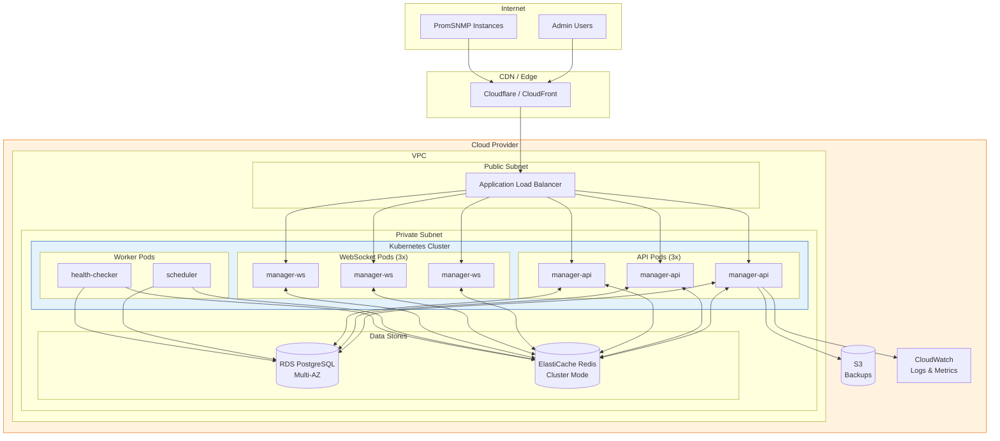

### Kubernetes Manifests

```yaml
# manager-deployment.yaml
apiVersion: apps/v1
kind: Deployment
metadata:
  name: promsnmp-manager-api
  namespace: promsnmp
spec:
  replicas: 3
  selector:
    matchLabels:
      app: promsnmp-manager
      component: api
  template:
    metadata:
      labels:
        app: promsnmp-manager
        component: api
    spec:
      containers:
        - name: api
          image: ghcr.io/example/promsnmp-manager:latest
          ports:
            - containerPort: 8080
              name: http
          env:
            - name: DATABASE_URL
              valueFrom:
                secretKeyRef:
                  name: promsnmp-manager-secrets
                  key: database-url
            - name: REDIS_URL
              valueFrom:
                secretKeyRef:
                  name: promsnmp-manager-secrets
                  key: redis-url
            - name: JWT_SECRET
              valueFrom:
                secretKeyRef:
                  name: promsnmp-manager-secrets
                  key: jwt-secret
          resources:
            requests:
              cpu: 250m
              memory: 512Mi
            limits:
              cpu: 1000m
              memory: 1Gi
          readinessProbe:
            httpGet:
              path: /health/ready
              port: 8080
            initialDelaySeconds: 5
            periodSeconds: 5
          livenessProbe:
            httpGet:
              path: /health/live
              port: 8080
            initialDelaySeconds: 10
            periodSeconds: 10
---
apiVersion: v1
kind: Service
metadata:
  name: promsnmp-manager
  namespace: promsnmp
spec:
  selector:
    app: promsnmp-manager
  ports:
    - name: http
      port: 80
      targetPort: 8080
    - name: ws
      port: 8081
      targetPort: 8081
---
apiVersion: networking.k8s.io/v1
kind: Ingress
metadata:
  name: promsnmp-manager
  namespace: promsnmp
  annotations:
    kubernetes.io/ingress.class: alb
    alb.ingress.kubernetes.io/scheme: internet-facing
    alb.ingress.kubernetes.io/certificate-arn: arn:aws:acm:...
spec:
  rules:
    - host: manager.promsnmp.example.com
      http:
        paths:
          - path: /api
            pathType: Prefix
            backend:
              service:
                name: promsnmp-manager
                port:
                  number: 80
          - path: /ws
            pathType: Prefix
            backend:
              service:
                name: promsnmp-manager
                port:
                  number: 8081
```

---

## Security

### Authentication Flow

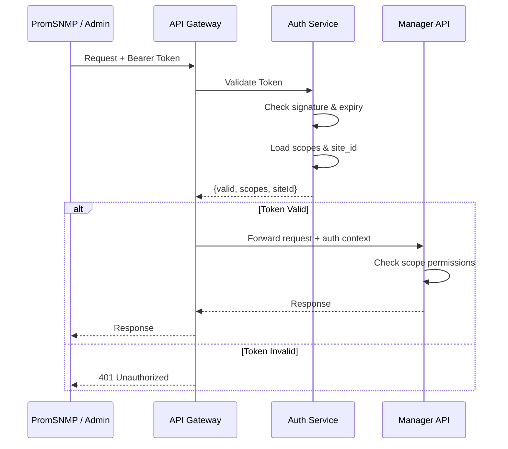

### Credential Encryption

SNMP credentials are encrypted at rest using AES-256-GCM:

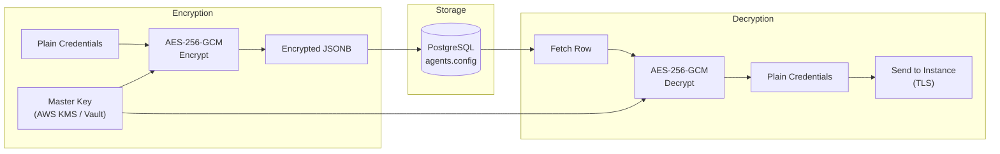

### Network Security

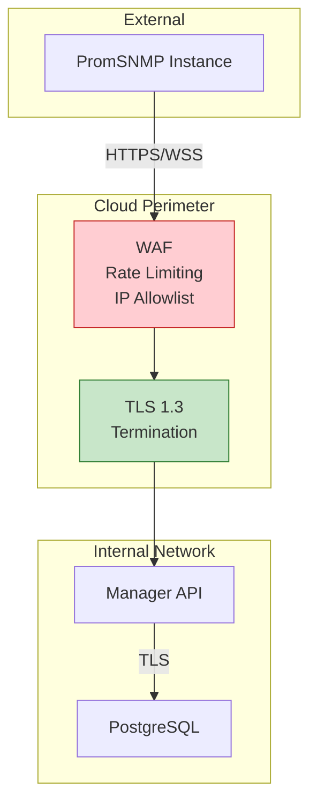

---

## Monitoring & Alerting

### Manager Metrics

```promql
# API request rate
rate(promsnmp_manager_http_requests_total[5m])

# API latency p99
histogram_quantile(0.99, rate(promsnmp_manager_http_request_duration_seconds_bucket[5m]))

# WebSocket connections
promsnmp_manager_websocket_connections_active

# Instance heartbeat age
time() - promsnmp_manager_instance_last_heartbeat_timestamp

# Database connection pool
promsnmp_manager_db_pool_connections_active
promsnmp_manager_db_pool_connections_idle
```

### Alert Rules

```yaml
groups:
  - name: promsnmp-manager
    rules:
      - alert: ManagerAPIHighLatency
        expr: |
          histogram_quantile(0.99, rate(promsnmp_manager_http_request_duration_seconds_bucket[5m])) > 1
        for: 5m
        labels:
          severity: warning
        annotations:
          summary: "Manager API p99 latency above 1s"

      - alert: ManagerAPIErrors
        expr: |
          rate(promsnmp_manager_http_requests_total{status=~"5.."}[5m]) > 0.1
        for: 5m
        labels:
          severity: critical
        annotations:
          summary: "Manager API returning 5xx errors"

      - alert: SiteNoLeader
        expr: |
          count by (site_id) (promsnmp_manager_instance_is_leader == 1) == 0
        for: 5m
        labels:
          severity: critical
        annotations:
          summary: "Site {{ $labels.site_id }} has no leader"

      - alert: InstanceUnhealthy
        expr: |
          time() - promsnmp_manager_instance_last_heartbeat_timestamp > 120
        for: 2m
        labels:
          severity: warning
        annotations:
          summary: "Instance {{ $labels.instance_id }} missed heartbeats"

      - alert: DiscoveryStale
        expr: |
          time() - promsnmp_manager_site_last_discovery_timestamp > 172800
        for: 1h
        labels:
          severity: warning
        annotations:
          summary: "Site {{ $labels.site_id }} discovery hasn't run in 48h"
```

---

## Summary

The PromSNMP Cloud Manager provides:

| Capability | Description |
|------------|-------------|
| **Centralized Inventory** | Single source of truth for all sites |
| **Leader Election** | Automatic, per-site leader assignment |
| **Real-time Sync** | WebSocket-based inventory updates |
| **Offline Resilience** | Graceful degradation with local cache |
| **Fleet Visibility** | Dashboard across all sites |
| **Audit Trail** | Full history of changes |
| **RBAC** | Token-based, scoped permissions |
| **Multi-tenancy Ready** | Site isolation with shared infrastructure |
