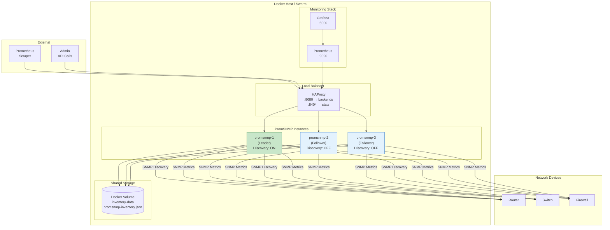
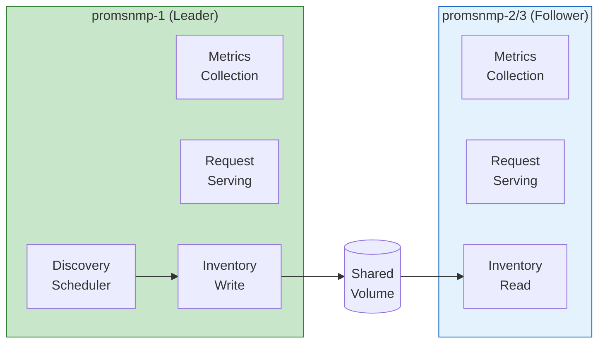
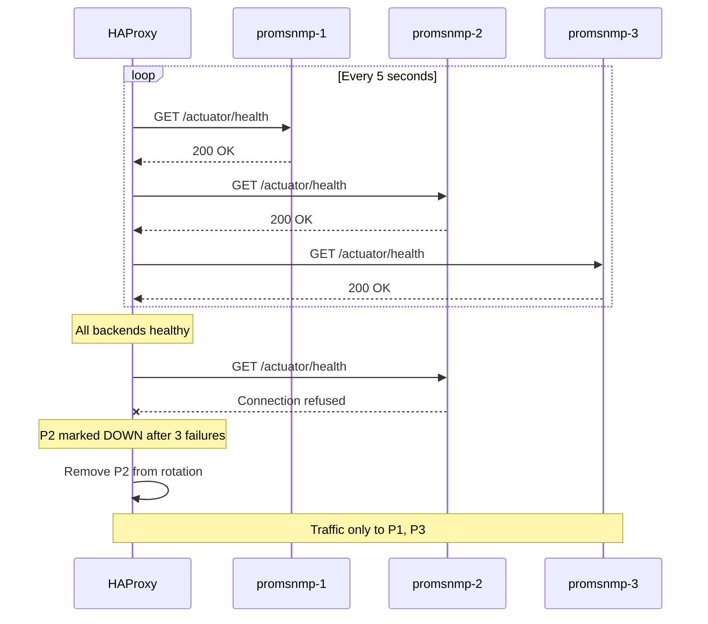
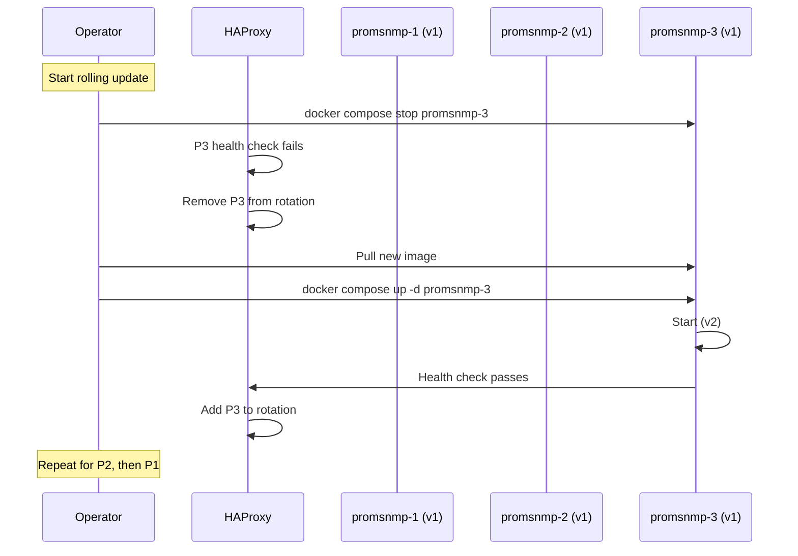
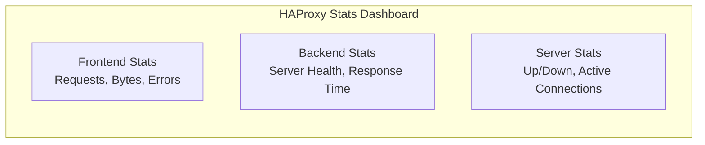

# PromSNMP Docker Compose Deployment

A fault-tolerant deployment of multiple PromSNMP containers using Docker Compose with HAProxy load balancing and shared storage.

---

## Architecture



---

## Quick Start

### 1. Create Project Directory

```bash
mkdir promsnmp-deployment && cd promsnmp-deployment
```

### 2. Create Docker Compose File

```yaml
# docker-compose.yml
version: "3.8"

services:
  # ===================
  # Load Balancer
  # ===================
  haproxy:
    image: haproxy:2.9-alpine
    container_name: promsnmp-lb
    ports:
      - "8080:8080"    # Main endpoint
      - "8404:8404"    # Stats dashboard
    volumes:
      - ./haproxy.cfg:/usr/local/etc/haproxy/haproxy.cfg:ro
    networks:
      - promsnmp-net
    depends_on:
      promsnmp-1:
        condition: service_healthy
      promsnmp-2:
        condition: service_healthy
      promsnmp-3:
        condition: service_healthy
    restart: unless-stopped

  # ===================
  # PromSNMP Leader
  # ===================
  promsnmp-1:
    image: ghcr.io/pbrane/promsnmp-metrics:latest
    container_name: promsnmp-1
    hostname: promsnmp-1
    environment:
      # Inventory
      - PROM_INV_FILE=/app/data/promsnmp-inventory.json
      - PROM_ENCRYPT_KEY=${PROM_ENCRYPT_KEY:-0123456789ABCDEF}

      # Site identification
      - PROM_SITE_ID=${PROM_SITE_ID:-site-001}
      - PROM_SITE_LABEL=${PROM_SITE_LABEL:-Primary Site}
      - PROM_TENANT_ID=${PROM_TENANT_ID:-default}

      # Leader configuration - THIS INSTANCE IS THE LEADER
      - DISCOVERY_ON_START=true
      - DISCOVERY_CRON=0 0 2 * * *
      - DISCOVERY_TZ=${TZ:-America/New_York}

      # Collection settings
      - COLLECTION_INTERVAL=30000
      - CACHE_EXP_MILLIS=300000
      - CACHE_ENTRY_CNT=10000
    volumes:
      - inventory-data:/app/data
    networks:
      - promsnmp-net
    healthcheck:
      test: ["CMD", "curl", "-f", "http://localhost:8080/actuator/health"]
      interval: 10s
      timeout: 5s
      retries: 3
      start_period: 30s
    deploy:
      resources:
        limits:
          memory: 1G
        reservations:
          memory: 512M
    restart: unless-stopped

  # ===================
  # PromSNMP Followers
  # ===================
  promsnmp-2:
    image: ghcr.io/pbrane/promsnmp-metrics:latest
    container_name: promsnmp-2
    hostname: promsnmp-2
    environment:
      - PROM_INV_FILE=/app/data/promsnmp-inventory.json
      - PROM_ENCRYPT_KEY=${PROM_ENCRYPT_KEY:-0123456789ABCDEF}
      - PROM_SITE_ID=${PROM_SITE_ID:-site-001}
      - PROM_SITE_LABEL=${PROM_SITE_LABEL:-Primary Site}
      - PROM_TENANT_ID=${PROM_TENANT_ID:-default}

      # Follower - NO discovery
      - DISCOVERY_ON_START=false
      - DISCOVERY_CRON=-

      - COLLECTION_INTERVAL=30000
      - CACHE_EXP_MILLIS=300000
      - CACHE_ENTRY_CNT=10000
    volumes:
      - inventory-data:/app/data
    networks:
      - promsnmp-net
    healthcheck:
      test: ["CMD", "curl", "-f", "http://localhost:8080/actuator/health"]
      interval: 10s
      timeout: 5s
      retries: 3
      start_period: 30s
    deploy:
      resources:
        limits:
          memory: 1G
        reservations:
          memory: 512M
    restart: unless-stopped

  promsnmp-3:
    image: ghcr.io/pbrane/promsnmp-metrics:latest
    container_name: promsnmp-3
    hostname: promsnmp-3
    environment:
      - PROM_INV_FILE=/app/data/promsnmp-inventory.json
      - PROM_ENCRYPT_KEY=${PROM_ENCRYPT_KEY:-0123456789ABCDEF}
      - PROM_SITE_ID=${PROM_SITE_ID:-site-001}
      - PROM_SITE_LABEL=${PROM_SITE_LABEL:-Primary Site}
      - PROM_TENANT_ID=${PROM_TENANT_ID:-default}

      # Follower - NO discovery
      - DISCOVERY_ON_START=false
      - DISCOVERY_CRON=-

      - COLLECTION_INTERVAL=30000
      - CACHE_EXP_MILLIS=300000
      - CACHE_ENTRY_CNT=10000
    volumes:
      - inventory-data:/app/data
    networks:
      - promsnmp-net
    healthcheck:
      test: ["CMD", "curl", "-f", "http://localhost:8080/actuator/health"]
      interval: 10s
      timeout: 5s
      retries: 3
      start_period: 30s
    deploy:
      resources:
        limits:
          memory: 1G
        reservations:
          memory: 512M
    restart: unless-stopped

  # ===================
  # Prometheus
  # ===================
  prometheus:
    image: prom/prometheus:latest
    container_name: prometheus
    ports:
      - "9090:9090"
    volumes:
      - ./prometheus.yml:/etc/prometheus/prometheus.yml:ro
      - prometheus-data:/prometheus
    command:
      - '--config.file=/etc/prometheus/prometheus.yml'
      - '--storage.tsdb.path=/prometheus'
      - '--web.enable-lifecycle'
      - '--enable-feature=native-histograms'
    networks:
      - promsnmp-net
    restart: unless-stopped

  # ===================
  # Grafana
  # ===================
  grafana:
    image: grafana/grafana:latest
    container_name: grafana
    ports:
      - "3000:3000"
    environment:
      - GF_SECURITY_ADMIN_PASSWORD=${GRAFANA_PASSWORD:-admin}
      - GF_USERS_ALLOW_SIGN_UP=false
    volumes:
      - grafana-data:/var/lib/grafana
      - ./grafana/provisioning:/etc/grafana/provisioning:ro
    networks:
      - promsnmp-net
    restart: unless-stopped

volumes:
  inventory-data:
    driver: local
  prometheus-data:
    driver: local
  grafana-data:
    driver: local

networks:
  promsnmp-net:
    driver: bridge
    ipam:
      config:
        - subnet: 172.28.0.0/16
```

### 3. Create HAProxy Configuration

```bash
cat > haproxy.cfg << 'EOF'
global
    daemon
    maxconn 4096
    log stdout format raw local0

defaults
    mode http
    timeout connect 5s
    timeout client 30s
    timeout server 30s
    log global
    option httplog

# Stats dashboard
frontend stats
    bind *:8404
    stats enable
    stats uri /stats
    stats refresh 10s
    stats admin if LOCALHOST

# Main frontend
frontend promsnmp_frontend
    bind *:8080
    default_backend promsnmp_backend

    # ACLs for routing
    acl is_metrics path_beg /metrics
    acl is_snmp path_beg /snmp
    acl is_targets path_beg /targets
    acl is_discovery path_beg /promsnmp/discovery

    # Route all traffic to backend
    use_backend promsnmp_backend if TRUE

# PromSNMP backend with health checks
backend promsnmp_backend
    balance roundrobin
    option httpchk GET /actuator/health
    http-check expect status 200

    # Servers with health checks
    server promsnmp-1 promsnmp-1:8080 check inter 5s fall 3 rise 2
    server promsnmp-2 promsnmp-2:8080 check inter 5s fall 3 rise 2
    server promsnmp-3 promsnmp-3:8080 check inter 5s fall 3 rise 2
EOF
```

### 4. Create Prometheus Configuration

```bash
cat > prometheus.yml << 'EOF'
global:
  scrape_interval: 30s
  evaluation_interval: 30s

scrape_configs:
  # Scrape PromSNMP instances directly for their own metrics
  - job_name: 'promsnmp-instances'
    static_configs:
      - targets:
          - 'promsnmp-1:8080'
          - 'promsnmp-2:8080'
          - 'promsnmp-3:8080'
    metrics_path: /actuator/prometheus

  # Scrape SNMP targets via HTTP Service Discovery
  - job_name: 'snmp-targets'
    http_sd_configs:
      - url: 'http://haproxy:8080/targets'
        refresh_interval: 60s

    # Rewrite to scrape through load balancer
    relabel_configs:
      - source_labels: [__address__]
        target_label: __param_target
      - source_labels: [__param_target]
        target_label: instance
      - target_label: __address__
        replacement: haproxy:8080

    metrics_path: /snmp

  # Scrape Prometheus itself
  - job_name: 'prometheus'
    static_configs:
      - targets: ['localhost:9090']
EOF
```

### 5. Create Environment File

```bash
cat > .env << 'EOF'
# Encryption key (MUST be 16 bytes for AES-128)
PROM_ENCRYPT_KEY=YourSecretKey123

# Site identification
PROM_SITE_ID=datacenter-01
PROM_SITE_LABEL=Primary Datacenter
PROM_TENANT_ID=acme-corp

# Timezone
TZ=America/New_York

# Grafana admin password
GRAFANA_PASSWORD=admin
EOF
```

### 6. Start the Stack

```bash
docker compose up -d
```

### 7. Verify Deployment

```bash
# Check all containers are running
docker compose ps

# Check HAProxy stats
curl http://localhost:8404/stats

# Check PromSNMP health
curl http://localhost:8080/actuator/health

# Check Prometheus targets
curl http://localhost:9090/api/v1/targets
```

---

## Component Details

### Leader vs Follower



| Capability | Leader | Follower |
|------------|--------|----------|
| Serve `/metrics` | Yes | Yes |
| Serve `/snmp` | Yes | Yes |
| Serve `/targets` | Yes | Yes |
| Run discovery | Yes | No |
| Write inventory | Yes | No |
| Read inventory | Yes | Yes |

### Health Check Flow



---

## Operations

### Scaling

#### Add More Followers

```yaml
# Add to docker-compose.yml
  promsnmp-4:
    image: ghcr.io/pbrane/promsnmp-metrics:latest
    container_name: promsnmp-4
    hostname: promsnmp-4
    environment:
      - PROM_INV_FILE=/app/data/promsnmp-inventory.json
      - PROM_ENCRYPT_KEY=${PROM_ENCRYPT_KEY:-0123456789ABCDEF}
      - DISCOVERY_ON_START=false
      - DISCOVERY_CRON=-
    volumes:
      - inventory-data:/app/data
    networks:
      - promsnmp-net
    healthcheck:
      test: ["CMD", "curl", "-f", "http://localhost:8080/actuator/health"]
      interval: 10s
      timeout: 5s
      retries: 3
```

Update HAProxy:
```bash
# Add to haproxy.cfg backend section
server promsnmp-4 promsnmp-4:8080 check inter 5s fall 3 rise 2
```

Apply changes:
```bash
docker compose up -d
docker kill -s HUP promsnmp-lb  # Reload HAProxy config
```

### Upgrading

#### Rolling Update



```bash
# Pull latest image
docker compose pull

# Update one at a time (followers first)
docker compose stop promsnmp-3
docker compose up -d promsnmp-3
sleep 30  # Wait for health check

docker compose stop promsnmp-2
docker compose up -d promsnmp-2
sleep 30

# Update leader last
docker compose stop promsnmp-1
docker compose up -d promsnmp-1
```

#### Blue-Green Update

```bash
# Create new compose file with updated image tag
cp docker-compose.yml docker-compose.green.yml
# Edit image tags in docker-compose.green.yml

# Start green stack on different ports
docker compose -f docker-compose.green.yml -p promsnmp-green up -d

# Test green stack
curl http://localhost:8081/actuator/health

# Switch HAProxy to green (edit haproxy.cfg)
# Update server lines to point to green containers

docker kill -s HUP promsnmp-lb

# Stop blue stack
docker compose down
```

### Failover

#### Manual Leader Failover

If the leader fails and doesn't recover:

```bash
# 1. Stop failed leader
docker compose stop promsnmp-1

# 2. Promote a follower to leader
docker compose stop promsnmp-2

# 3. Update environment to make it leader
# Edit docker-compose.yml: set DISCOVERY_ON_START=true for promsnmp-2

# 4. Start new leader
docker compose up -d promsnmp-2

# 5. Optionally restart old leader as follower
# Edit docker-compose.yml: set DISCOVERY_ON_START=false for promsnmp-1
docker compose up -d promsnmp-1
```

#### Automatic Leader Election (with Redis)

For automatic failover, add Redis:

```yaml
# Add to docker-compose.yml
  redis:
    image: redis:7-alpine
    container_name: promsnmp-redis
    command: redis-server --appendonly yes
    volumes:
      - redis-data:/data
    networks:
      - promsnmp-net
    restart: unless-stopped

volumes:
  redis-data:
```

Then configure PromSNMP instances to use Redis for leader election (requires application support).

---

## Monitoring

### HAProxy Stats

Access the HAProxy stats dashboard at `http://localhost:8404/stats`



### Prometheus Queries

```promql
# PromSNMP instance health
up{job="promsnmp-instances"}

# Requests per second through HAProxy
rate(haproxy_frontend_http_requests_total[5m])

# Backend response time (if HAProxy exports metrics)
haproxy_backend_response_time_average_seconds

# Cache hit rate per instance
rate(cache_gets_total{cache="metrics",result="hit"}[5m]) /
rate(cache_gets_total{cache="metrics"}[5m])

# SNMP devices discovered
promsnmp_inventory_device_count

# Memory usage per instance
jvm_memory_used_bytes{job="promsnmp-instances"}
```

### Alerts

Create `alerts.yml`:

```yaml
groups:
  - name: promsnmp-docker
    rules:
      - alert: PromSNMPInstanceDown
        expr: up{job="promsnmp-instances"} == 0
        for: 1m
        labels:
          severity: critical
        annotations:
          summary: "PromSNMP instance {{ $labels.instance }} is down"

      - alert: PromSNMPAllInstancesDown
        expr: count(up{job="promsnmp-instances"} == 1) == 0
        for: 30s
        labels:
          severity: critical
        annotations:
          summary: "All PromSNMP instances are down"

      - alert: PromSNMPHighMemory
        expr: jvm_memory_used_bytes{job="promsnmp-instances",area="heap"} / jvm_memory_max_bytes > 0.9
        for: 5m
        labels:
          severity: warning
        annotations:
          summary: "PromSNMP {{ $labels.instance }} heap usage above 90%"

      - alert: PromSNMPCacheHitRateLow
        expr: |
          rate(cache_gets_total{cache="metrics",result="hit"}[5m]) /
          rate(cache_gets_total{cache="metrics"}[5m]) < 0.5
        for: 15m
        labels:
          severity: warning
        annotations:
          summary: "PromSNMP cache hit rate below 50%"
```

---

## NFS Shared Storage (Multi-Host)

For Docker Swarm or multi-host deployments, use NFS:

```yaml
volumes:
  inventory-data:
    driver: local
    driver_opts:
      type: nfs
      o: addr=${NFS_SERVER},rw,nolock,soft
      device: ":${NFS_PATH:-/exports/promsnmp}"
```

```bash
# Set NFS server in .env
echo "NFS_SERVER=192.168.1.100" >> .env
echo "NFS_PATH=/exports/promsnmp" >> .env
```

### NFS Server Setup (Ubuntu)

```bash
# On NFS server
sudo apt install nfs-kernel-server
sudo mkdir -p /exports/promsnmp
sudo chown nobody:nogroup /exports/promsnmp
sudo chmod 777 /exports/promsnmp

# Add to /etc/exports
echo "/exports/promsnmp *(rw,sync,no_subtree_check,no_root_squash)" | sudo tee -a /etc/exports

sudo exportfs -ra
sudo systemctl restart nfs-kernel-server
```

---

## Docker Swarm Deployment

For production multi-host deployment:

```yaml
# docker-stack.yml
version: "3.8"

services:
  promsnmp:
    image: ghcr.io/pbrane/promsnmp-metrics:latest
    environment:
      - PROM_INV_FILE=/app/data/promsnmp-inventory.json
      - PROM_ENCRYPT_KEY=${PROM_ENCRYPT_KEY}
    volumes:
      - inventory-data:/app/data
    networks:
      - promsnmp-net
    deploy:
      replicas: 3
      update_config:
        parallelism: 1
        delay: 30s
        failure_action: rollback
      rollback_config:
        parallelism: 1
      restart_policy:
        condition: on-failure
        delay: 5s
        max_attempts: 3
      resources:
        limits:
          memory: 1G
        reservations:
          memory: 512M
    healthcheck:
      test: ["CMD", "curl", "-f", "http://localhost:8080/actuator/health"]
      interval: 10s
      timeout: 5s
      retries: 3

  haproxy:
    image: haproxy:2.9-alpine
    ports:
      - "8080:8080"
      - "8404:8404"
    volumes:
      - ./haproxy.cfg:/usr/local/etc/haproxy/haproxy.cfg:ro
    networks:
      - promsnmp-net
    deploy:
      replicas: 2
      placement:
        constraints:
          - node.role == manager

volumes:
  inventory-data:
    driver: local
    driver_opts:
      type: nfs
      o: addr=${NFS_SERVER},rw,nolock
      device: ":${NFS_PATH}"

networks:
  promsnmp-net:
    driver: overlay
```

Deploy to Swarm:

```bash
docker stack deploy -c docker-stack.yml promsnmp
```

---

## Troubleshooting

### Container Won't Start

```bash
# Check logs
docker compose logs promsnmp-1

# Common issues:
# - Invalid PROM_ENCRYPT_KEY (must be 16 bytes)
# - Volume mount permissions
# - Port conflicts
```

### HAProxy Shows Backend DOWN

```bash
# Check container health
docker inspect promsnmp-1 --format='{{.State.Health.Status}}'

# Check container logs
docker compose logs promsnmp-1 --tail=50

# Test health endpoint directly
docker exec promsnmp-1 curl -s http://localhost:8080/actuator/health
```

### Inventory Not Syncing

```bash
# Check volume contents
docker exec promsnmp-1 ls -la /app/data/

# Check if leader is writing
docker exec promsnmp-1 cat /app/data/promsnmp-inventory.json | head

# Verify volume is shared
docker volume inspect promsnmp-deployment_inventory-data
```

### High Memory Usage

```bash
# Check JVM memory
docker exec promsnmp-1 curl -s http://localhost:8080/actuator/metrics/jvm.memory.used

# Increase container memory limit in docker-compose.yml
# Or tune JVM settings:
environment:
  - JAVA_OPTS=-Xmx768m -Xms512m
```

---

## Complete File Structure

```
promsnmp-deployment/
├── docker-compose.yml
├── docker-stack.yml        # For Swarm
├── haproxy.cfg
├── prometheus.yml
├── alerts.yml
├── .env
└── grafana/
    └── provisioning/
        ├── datasources/
        │   └── prometheus.yml
        └── dashboards/
            └── promsnmp.json
```

---

## Summary

| Component | Purpose | Port |
|-----------|---------|------|
| HAProxy | Load balancer | 8080, 8404 |
| promsnmp-1 | Leader instance | (internal) |
| promsnmp-2 | Follower instance | (internal) |
| promsnmp-3 | Follower instance | (internal) |
| Prometheus | Metrics storage | 9090 |
| Grafana | Dashboards | 3000 |

**Key Configuration:**
- Leader: `DISCOVERY_ON_START=true`, `DISCOVERY_CRON=0 0 2 * * *`
- Follower: `DISCOVERY_ON_START=false`, `DISCOVERY_CRON=-`
- All instances share the same `inventory-data` volume
