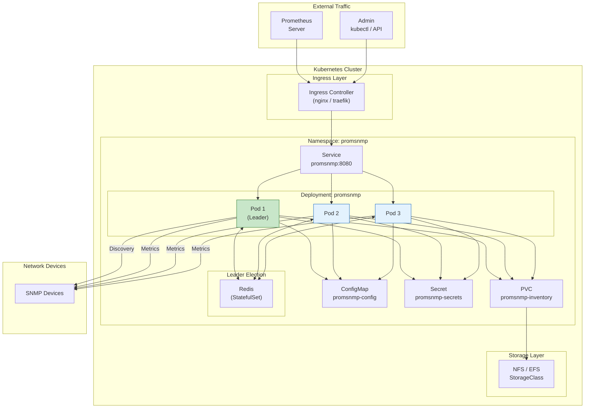
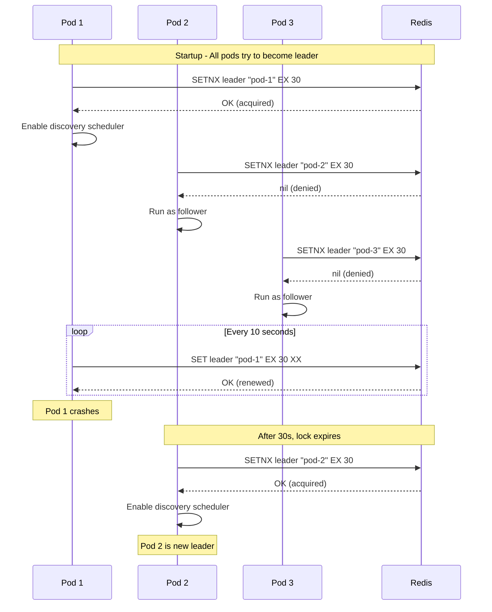
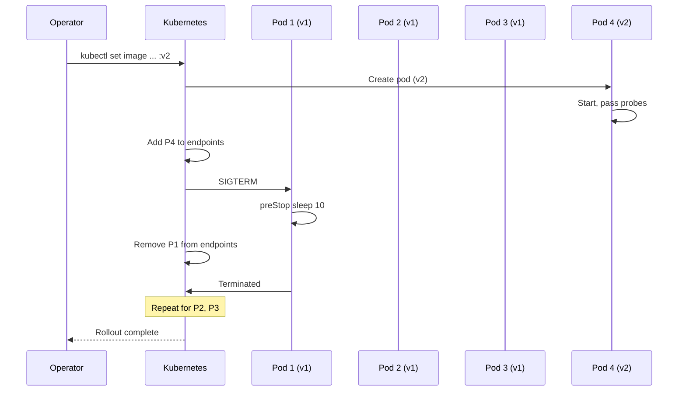

# PromSNMP Kubernetes Deployment

A fault-tolerant, auto-scaling deployment of PromSNMP on Kubernetes with leader election, persistent storage, and rolling updates.

---

## Architecture



---

## Quick Start

### 1. Create Namespace

```bash
kubectl create namespace promsnmp
```

### 2. Apply All Manifests

```bash
kubectl apply -f https://raw.githubusercontent.com/pbrane/promsnmp-metrics/main/deploy/kubernetes/
```

Or apply individually:

```bash
kubectl apply -f namespace.yaml
kubectl apply -f configmap.yaml
kubectl apply -f secret.yaml
kubectl apply -f pvc.yaml
kubectl apply -f redis.yaml
kubectl apply -f deployment.yaml
kubectl apply -f service.yaml
kubectl apply -f pdb.yaml
```

### 3. Verify Deployment

```bash
kubectl get all -n promsnmp
kubectl get pods -n promsnmp -w
```

---

## Manifests

### Namespace

```yaml
# namespace.yaml
apiVersion: v1
kind: Namespace
metadata:
  name: promsnmp
  labels:
    app.kubernetes.io/name: promsnmp
    app.kubernetes.io/component: monitoring
```

### ConfigMap

```yaml
# configmap.yaml
apiVersion: v1
kind: ConfigMap
metadata:
  name: promsnmp-config
  namespace: promsnmp
  labels:
    app.kubernetes.io/name: promsnmp
data:
  # Inventory file path (on PVC)
  PROM_INV_FILE: "/app/data/promsnmp-inventory.json"

  # Site identification
  PROM_SITE_ID: "k8s-site-001"
  PROM_SITE_LABEL: "Kubernetes Cluster"
  PROM_TENANT_ID: "default"

  # Discovery settings (leader will override via election)
  DISCOVERY_CRON: "0 0 2 * * *"
  DISCOVERY_TZ: "America/New_York"

  # Metrics collection
  COLLECTION_INTERVAL: "30000"

  # Cache settings
  CACHE_EXP_MILLIS: "300000"
  CACHE_ENTRY_CNT: "10000"

  # Redis for leader election
  REDIS_HOST: "redis"
  REDIS_PORT: "6379"
```

### Secret

```yaml
# secret.yaml
apiVersion: v1
kind: Secret
metadata:
  name: promsnmp-secrets
  namespace: promsnmp
  labels:
    app.kubernetes.io/name: promsnmp
type: Opaque
stringData:
  # Encryption key (MUST be 16 bytes)
  PROM_ENCRYPT_KEY: "change-me-16byte"

  # Redis password (if enabled)
  REDIS_PASSWORD: ""
```

Generate a proper encryption key:

```bash
# Generate random 16-byte key
KEY=$(openssl rand -base64 12 | tr -d '\n' | head -c 16)
kubectl create secret generic promsnmp-secrets \
  --namespace promsnmp \
  --from-literal=PROM_ENCRYPT_KEY="$KEY" \
  --dry-run=client -o yaml | kubectl apply -f -
```

### PersistentVolumeClaim

```yaml
# pvc.yaml
apiVersion: v1
kind: PersistentVolumeClaim
metadata:
  name: promsnmp-inventory
  namespace: promsnmp
  labels:
    app.kubernetes.io/name: promsnmp
spec:
  accessModes:
    - ReadWriteMany  # Required for multi-pod access
  storageClassName: nfs-client  # Or: efs-sc, azurefile, etc.
  resources:
    requests:
      storage: 1Gi
```

#### Storage Class Examples

**AWS EFS:**
```yaml
apiVersion: storage.k8s.io/v1
kind: StorageClass
metadata:
  name: efs-sc
provisioner: efs.csi.aws.com
parameters:
  provisioningMode: efs-ap
  fileSystemId: fs-xxxxxxxxx
  directoryPerms: "700"
```

**Azure Files:**
```yaml
apiVersion: storage.k8s.io/v1
kind: StorageClass
metadata:
  name: azurefile
provisioner: kubernetes.io/azure-file
parameters:
  skuName: Standard_LRS
mountOptions:
  - dir_mode=0777
  - file_mode=0777
```

**NFS (via nfs-subdir-external-provisioner):**
```yaml
apiVersion: storage.k8s.io/v1
kind: StorageClass
metadata:
  name: nfs-client
provisioner: cluster.local/nfs-subdir-external-provisioner
parameters:
  archiveOnDelete: "false"
```

### Redis (Leader Election)

```yaml
# redis.yaml
apiVersion: apps/v1
kind: StatefulSet
metadata:
  name: redis
  namespace: promsnmp
spec:
  serviceName: redis
  replicas: 1
  selector:
    matchLabels:
      app: redis
  template:
    metadata:
      labels:
        app: redis
    spec:
      containers:
        - name: redis
          image: redis:7-alpine
          ports:
            - containerPort: 6379
          command:
            - redis-server
            - --appendonly
            - "yes"
          resources:
            requests:
              cpu: 100m
              memory: 128Mi
            limits:
              cpu: 500m
              memory: 256Mi
          volumeMounts:
            - name: redis-data
              mountPath: /data
  volumeClaimTemplates:
    - metadata:
        name: redis-data
      spec:
        accessModes: ["ReadWriteOnce"]
        resources:
          requests:
            storage: 1Gi
---
apiVersion: v1
kind: Service
metadata:
  name: redis
  namespace: promsnmp
spec:
  selector:
    app: redis
  ports:
    - port: 6379
      targetPort: 6379
```

### Deployment

```yaml
# deployment.yaml
apiVersion: apps/v1
kind: Deployment
metadata:
  name: promsnmp
  namespace: promsnmp
  labels:
    app.kubernetes.io/name: promsnmp
    app.kubernetes.io/component: exporter
spec:
  replicas: 3
  selector:
    matchLabels:
      app.kubernetes.io/name: promsnmp
  strategy:
    type: RollingUpdate
    rollingUpdate:
      maxUnavailable: 1
      maxSurge: 1
  template:
    metadata:
      labels:
        app.kubernetes.io/name: promsnmp
      annotations:
        prometheus.io/scrape: "true"
        prometheus.io/port: "8080"
        prometheus.io/path: "/actuator/prometheus"
    spec:
      serviceAccountName: promsnmp
      terminationGracePeriodSeconds: 60

      # Anti-affinity: spread pods across nodes
      affinity:
        podAntiAffinity:
          preferredDuringSchedulingIgnoredDuringExecution:
            - weight: 100
              podAffinityTerm:
                labelSelector:
                  matchLabels:
                    app.kubernetes.io/name: promsnmp
                topologyKey: kubernetes.io/hostname

      containers:
        - name: promsnmp
          image: ghcr.io/pbrane/promsnmp-metrics:latest
          imagePullPolicy: Always

          ports:
            - name: http
              containerPort: 8080
              protocol: TCP

          envFrom:
            - configMapRef:
                name: promsnmp-config
            - secretRef:
                name: promsnmp-secrets

          env:
            # Pod identification for leader election
            - name: POD_NAME
              valueFrom:
                fieldRef:
                  fieldPath: metadata.name
            - name: POD_NAMESPACE
              valueFrom:
                fieldRef:
                  fieldPath: metadata.namespace
            - name: POD_IP
              valueFrom:
                fieldRef:
                  fieldPath: status.podIP

          resources:
            requests:
              cpu: 250m
              memory: 512Mi
            limits:
              cpu: 1000m
              memory: 1Gi

          volumeMounts:
            - name: inventory
              mountPath: /app/data

          # Startup probe: allow up to 150s for initial startup
          startupProbe:
            httpGet:
              path: /actuator/health
              port: 8080
            initialDelaySeconds: 5
            periodSeconds: 5
            failureThreshold: 30

          # Readiness: only route traffic when ready
          readinessProbe:
            httpGet:
              path: /actuator/health/readiness
              port: 8080
            initialDelaySeconds: 10
            periodSeconds: 5
            failureThreshold: 3

          # Liveness: restart if unhealthy
          livenessProbe:
            httpGet:
              path: /actuator/health/liveness
              port: 8080
            initialDelaySeconds: 30
            periodSeconds: 10
            failureThreshold: 3

          lifecycle:
            preStop:
              exec:
                # Graceful shutdown: allow in-flight requests to complete
                command: ["/bin/sh", "-c", "sleep 10"]

      volumes:
        - name: inventory
          persistentVolumeClaim:
            claimName: promsnmp-inventory
```

### Service

```yaml
# service.yaml
apiVersion: v1
kind: Service
metadata:
  name: promsnmp
  namespace: promsnmp
  labels:
    app.kubernetes.io/name: promsnmp
  annotations:
    prometheus.io/scrape: "true"
    prometheus.io/port: "8080"
spec:
  type: ClusterIP
  ports:
    - name: http
      port: 8080
      targetPort: 8080
      protocol: TCP
  selector:
    app.kubernetes.io/name: promsnmp
```

### PodDisruptionBudget

```yaml
# pdb.yaml
apiVersion: policy/v1
kind: PodDisruptionBudget
metadata:
  name: promsnmp-pdb
  namespace: promsnmp
spec:
  minAvailable: 2
  selector:
    matchLabels:
      app.kubernetes.io/name: promsnmp
```

### ServiceAccount & RBAC

```yaml
# rbac.yaml
apiVersion: v1
kind: ServiceAccount
metadata:
  name: promsnmp
  namespace: promsnmp
---
apiVersion: rbac.authorization.k8s.io/v1
kind: Role
metadata:
  name: promsnmp-leader-election
  namespace: promsnmp
rules:
  - apiGroups: ["coordination.k8s.io"]
    resources: ["leases"]
    verbs: ["get", "create", "update"]
---
apiVersion: rbac.authorization.k8s.io/v1
kind: RoleBinding
metadata:
  name: promsnmp-leader-election
  namespace: promsnmp
subjects:
  - kind: ServiceAccount
    name: promsnmp
    namespace: promsnmp
roleRef:
  kind: Role
  name: promsnmp-leader-election
  apiGroup: rbac.authorization.k8s.io
```

### Ingress

```yaml
# ingress.yaml
apiVersion: networking.k8s.io/v1
kind: Ingress
metadata:
  name: promsnmp
  namespace: promsnmp
  annotations:
    kubernetes.io/ingress.class: nginx
    # For TLS termination
    # cert-manager.io/cluster-issuer: letsencrypt-prod
spec:
  rules:
    - host: promsnmp.example.com
      http:
        paths:
          - path: /
            pathType: Prefix
            backend:
              service:
                name: promsnmp
                port:
                  number: 8080
  # tls:
  #   - hosts:
  #       - promsnmp.example.com
  #     secretName: promsnmp-tls
```

### HorizontalPodAutoscaler

```yaml
# hpa.yaml
apiVersion: autoscaling/v2
kind: HorizontalPodAutoscaler
metadata:
  name: promsnmp
  namespace: promsnmp
spec:
  scaleTargetRef:
    apiVersion: apps/v1
    kind: Deployment
    name: promsnmp
  minReplicas: 3
  maxReplicas: 10
  metrics:
    - type: Resource
      resource:
        name: cpu
        target:
          type: Utilization
          averageUtilization: 70
    - type: Resource
      resource:
        name: memory
        target:
          type: Utilization
          averageUtilization: 80
  behavior:
    scaleDown:
      stabilizationWindowSeconds: 300
      policies:
        - type: Pods
          value: 1
          periodSeconds: 60
    scaleUp:
      stabilizationWindowSeconds: 0
      policies:
        - type: Pods
          value: 2
          periodSeconds: 60
```

---

## Leader Election

### How It Works



### Alternative: Kubernetes Lease

```yaml
# Using K8s native leader election (requires application support)
apiVersion: coordination.k8s.io/v1
kind: Lease
metadata:
  name: promsnmp-leader
  namespace: promsnmp
spec:
  holderIdentity: ""
  leaseDurationSeconds: 30
  acquireTime: null
  renewTime: null
```

---

## Operations

### Scaling

```bash
# Manual scaling
kubectl scale deployment promsnmp -n promsnmp --replicas=5

# Or update HPA
kubectl patch hpa promsnmp -n promsnmp -p '{"spec":{"minReplicas":5}}'
```

### Rolling Update



```bash
# Update image
kubectl set image deployment/promsnmp \
  promsnmp=ghcr.io/pbrane/promsnmp-metrics:v0.0.11 \
  -n promsnmp

# Watch rollout
kubectl rollout status deployment/promsnmp -n promsnmp

# Rollback if needed
kubectl rollout undo deployment/promsnmp -n promsnmp
```

### Blue-Green Deployment

```bash
# Create green deployment
kubectl apply -f - <<EOF
apiVersion: apps/v1
kind: Deployment
metadata:
  name: promsnmp-green
  namespace: promsnmp
spec:
  replicas: 3
  selector:
    matchLabels:
      app.kubernetes.io/name: promsnmp
      version: green
  template:
    metadata:
      labels:
        app.kubernetes.io/name: promsnmp
        version: green
    spec:
      # ... same as blue but with new image
EOF

# Wait for green to be ready
kubectl rollout status deployment/promsnmp-green -n promsnmp

# Switch service to green
kubectl patch service promsnmp -n promsnmp \
  -p '{"spec":{"selector":{"version":"green"}}}'

# Scale down blue
kubectl scale deployment promsnmp -n promsnmp --replicas=0
```

### Canary Deployment (with Istio)

```yaml
apiVersion: networking.istio.io/v1beta1
kind: VirtualService
metadata:
  name: promsnmp
  namespace: promsnmp
spec:
  hosts:
    - promsnmp
  http:
    - route:
        - destination:
            host: promsnmp
            subset: stable
          weight: 90
        - destination:
            host: promsnmp
            subset: canary
          weight: 10
---
apiVersion: networking.istio.io/v1beta1
kind: DestinationRule
metadata:
  name: promsnmp
  namespace: promsnmp
spec:
  host: promsnmp
  subsets:
    - name: stable
      labels:
        version: stable
    - name: canary
      labels:
        version: canary
```

---

## Monitoring

### Prometheus ServiceMonitor

```yaml
# servicemonitor.yaml
apiVersion: monitoring.coreos.com/v1
kind: ServiceMonitor
metadata:
  name: promsnmp
  namespace: promsnmp
  labels:
    app.kubernetes.io/name: promsnmp
spec:
  selector:
    matchLabels:
      app.kubernetes.io/name: promsnmp
  endpoints:
    - port: http
      path: /actuator/prometheus
      interval: 30s
  namespaceSelector:
    matchNames:
      - promsnmp
```

### PrometheusRule (Alerts)

```yaml
# prometheusrule.yaml
apiVersion: monitoring.coreos.com/v1
kind: PrometheusRule
metadata:
  name: promsnmp-alerts
  namespace: promsnmp
spec:
  groups:
    - name: promsnmp
      rules:
        - alert: PromSNMPPodNotReady
          expr: |
            kube_pod_status_ready{namespace="promsnmp",condition="true"} == 0
          for: 5m
          labels:
            severity: warning
          annotations:
            summary: "PromSNMP pod {{ $labels.pod }} not ready"

        - alert: PromSNMPReplicasLow
          expr: |
            kube_deployment_status_replicas_available{
              namespace="promsnmp",
              deployment="promsnmp"
            } < 2
          for: 5m
          labels:
            severity: critical
          annotations:
            summary: "PromSNMP has fewer than 2 available replicas"

        - alert: PromSNMPNoLeader
          expr: |
            count(promsnmp_leader_election_is_leader{namespace="promsnmp"} == 1) == 0
          for: 5m
          labels:
            severity: critical
          annotations:
            summary: "No PromSNMP pod is acting as leader"

        - alert: PromSNMPHighMemory
          expr: |
            container_memory_usage_bytes{
              namespace="promsnmp",
              container="promsnmp"
            } / container_spec_memory_limit_bytes > 0.9
          for: 5m
          labels:
            severity: warning
          annotations:
            summary: "PromSNMP pod {{ $labels.pod }} memory usage above 90%"

        - alert: PromSNMPHighCPU
          expr: |
            rate(container_cpu_usage_seconds_total{
              namespace="promsnmp",
              container="promsnmp"
            }[5m]) > 0.9
          for: 10m
          labels:
            severity: warning
          annotations:
            summary: "PromSNMP pod {{ $labels.pod }} CPU usage above 90%"

        - alert: PromSNMPCacheHitRateLow
          expr: |
            rate(cache_gets_total{
              namespace="promsnmp",
              cache="metrics",
              result="hit"
            }[5m]) /
            rate(cache_gets_total{
              namespace="promsnmp",
              cache="metrics"
            }[5m]) < 0.5
          for: 15m
          labels:
            severity: warning
          annotations:
            summary: "PromSNMP cache hit rate below 50%"

        - alert: PromSNMPDiscoveryStale
          expr: |
            time() - promsnmp_last_discovery_timestamp{namespace="promsnmp"} > 172800
          for: 1h
          labels:
            severity: warning
          annotations:
            summary: "PromSNMP discovery hasn't run in 48 hours"
```

### Grafana Dashboard

```bash
# Import dashboard from ConfigMap
kubectl create configmap promsnmp-dashboard \
  --from-file=dashboard.json \
  -n monitoring

# Label for Grafana sidecar discovery
kubectl label configmap promsnmp-dashboard grafana_dashboard=1 -n monitoring
```

---

## Prometheus Configuration

### Static Configuration

```yaml
# prometheus.yml
scrape_configs:
  # Scrape PromSNMP pods directly
  - job_name: 'promsnmp'
    kubernetes_sd_configs:
      - role: pod
        namespaces:
          names: ['promsnmp']
    relabel_configs:
      - source_labels: [__meta_kubernetes_pod_label_app_kubernetes_io_name]
        regex: promsnmp
        action: keep
      - source_labels: [__meta_kubernetes_pod_annotation_prometheus_io_scrape]
        regex: "true"
        action: keep
      - source_labels: [__meta_kubernetes_pod_ip]
        target_label: __address__
        replacement: $1:8080

  # Scrape SNMP targets via HTTP SD
  - job_name: 'snmp-targets'
    http_sd_configs:
      - url: 'http://promsnmp.promsnmp.svc:8080/targets'
        refresh_interval: 60s
    relabel_configs:
      - source_labels: [__address__]
        target_label: __param_target
      - source_labels: [__param_target]
        target_label: instance
      - target_label: __address__
        replacement: promsnmp.promsnmp.svc:8080
    metrics_path: /snmp
```

---

## Network Policies

```yaml
# networkpolicy.yaml
apiVersion: networking.k8s.io/v1
kind: NetworkPolicy
metadata:
  name: promsnmp-network-policy
  namespace: promsnmp
spec:
  podSelector:
    matchLabels:
      app.kubernetes.io/name: promsnmp
  policyTypes:
    - Ingress
    - Egress
  ingress:
    # Allow traffic from Prometheus
    - from:
        - namespaceSelector:
            matchLabels:
              name: monitoring
          podSelector:
            matchLabels:
              app: prometheus
      ports:
        - port: 8080
          protocol: TCP
    # Allow traffic from other promsnmp pods
    - from:
        - podSelector:
            matchLabels:
              app.kubernetes.io/name: promsnmp
      ports:
        - port: 8080
          protocol: TCP
    # Allow traffic from ingress controller
    - from:
        - namespaceSelector:
            matchLabels:
              name: ingress-nginx
      ports:
        - port: 8080
          protocol: TCP
  egress:
    # Allow DNS
    - to:
        - namespaceSelector: {}
          podSelector:
            matchLabels:
              k8s-app: kube-dns
      ports:
        - port: 53
          protocol: UDP
    # Allow Redis
    - to:
        - podSelector:
            matchLabels:
              app: redis
      ports:
        - port: 6379
          protocol: TCP
    # Allow SNMP to any destination (customize as needed)
    - to:
        - ipBlock:
            cidr: 0.0.0.0/0
      ports:
        - port: 161
          protocol: UDP
        - port: 162
          protocol: UDP
```

---

## Troubleshooting

### Pod Not Starting

```bash
# Check pod events
kubectl describe pod -l app.kubernetes.io/name=promsnmp -n promsnmp

# Check logs
kubectl logs -l app.kubernetes.io/name=promsnmp -n promsnmp --tail=100

# Common issues:
# - PVC not bound (check StorageClass)
# - Invalid secret (PROM_ENCRYPT_KEY must be 16 bytes)
# - Image pull errors
```

### PVC Not Binding

```bash
# Check PVC status
kubectl get pvc -n promsnmp

# Check events
kubectl describe pvc promsnmp-inventory -n promsnmp

# Verify StorageClass exists and supports RWX
kubectl get storageclass
```

### Leader Election Issues

```bash
# Check Redis
kubectl exec -it redis-0 -n promsnmp -- redis-cli GET leader

# Check which pod is leader
kubectl logs -l app.kubernetes.io/name=promsnmp -n promsnmp | grep -i leader

# Force leader re-election
kubectl exec -it redis-0 -n promsnmp -- redis-cli DEL leader
```

### High Memory Usage

```bash
# Check pod resource usage
kubectl top pods -n promsnmp

# Get JVM metrics
kubectl exec -it <pod> -n promsnmp -- \
  curl -s localhost:8080/actuator/metrics/jvm.memory.used

# Increase limits
kubectl patch deployment promsnmp -n promsnmp \
  -p '{"spec":{"template":{"spec":{"containers":[{"name":"promsnmp","resources":{"limits":{"memory":"2Gi"}}}]}}}}'
```

### Inventory Not Syncing

```bash
# Check PVC contents
kubectl exec -it <pod> -n promsnmp -- ls -la /app/data/

# Check inventory file
kubectl exec -it <pod> -n promsnmp -- cat /app/data/promsnmp-inventory.json | head

# Verify all pods see the same file
for pod in $(kubectl get pods -n promsnmp -o name); do
  echo "=== $pod ==="
  kubectl exec -it $pod -n promsnmp -- md5sum /app/data/promsnmp-inventory.json
done
```

---

## Helm Chart (Optional)

```yaml
# values.yaml
replicaCount: 3

image:
  repository: ghcr.io/pbrane/promsnmp-metrics
  tag: latest
  pullPolicy: Always

config:
  siteId: "k8s-site-001"
  siteLabel: "Kubernetes Cluster"
  tenantId: "default"
  discoveryCron: "0 0 2 * * *"
  discoveryTimezone: "America/New_York"
  collectionInterval: 30000
  cacheExpiration: 300000
  cacheMaxEntries: 10000

secrets:
  encryptKey: ""  # Will be auto-generated if empty

persistence:
  enabled: true
  storageClass: "nfs-client"
  size: 1Gi

redis:
  enabled: true
  architecture: standalone

resources:
  requests:
    cpu: 250m
    memory: 512Mi
  limits:
    cpu: 1000m
    memory: 1Gi

autoscaling:
  enabled: true
  minReplicas: 3
  maxReplicas: 10
  targetCPUUtilization: 70
  targetMemoryUtilization: 80

podDisruptionBudget:
  enabled: true
  minAvailable: 2

serviceMonitor:
  enabled: true
```

Install with Helm:

```bash
helm install promsnmp ./charts/promsnmp \
  --namespace promsnmp \
  --create-namespace \
  -f values.yaml
```

---

## Summary

| Component | Resource | Purpose |
|-----------|----------|---------|
| Deployment | `promsnmp` | Main application pods |
| Service | `promsnmp` | Internal load balancing |
| ConfigMap | `promsnmp-config` | Configuration |
| Secret | `promsnmp-secrets` | Encryption key |
| PVC | `promsnmp-inventory` | Shared storage |
| StatefulSet | `redis` | Leader election |
| PDB | `promsnmp-pdb` | Availability guarantee |
| HPA | `promsnmp` | Auto-scaling |
| ServiceMonitor | `promsnmp` | Prometheus integration |
| NetworkPolicy | `promsnmp-network-policy` | Network security |

**Key Points:**
- Use `ReadWriteMany` PVC for shared inventory
- Redis handles leader election automatically
- Rolling updates with `maxUnavailable: 1`
- PDB ensures minimum 2 pods available
- HPA scales based on CPU/memory
