# PromSNMP Deployment Overview

This guide helps you choose the right deployment strategy for your PromSNMP installation based on your infrastructure, scale, and operational requirements.

---

## Deployment Options

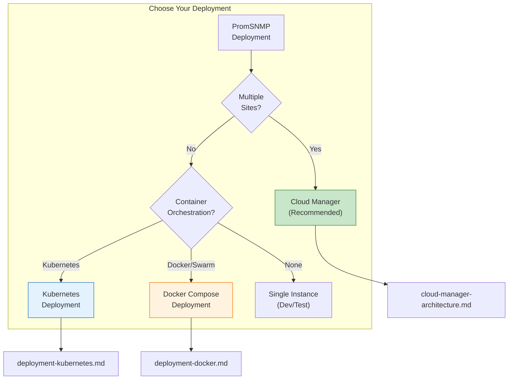

---

## Comparison Matrix

| Feature | Docker Compose | Kubernetes | Cloud Manager |
|---------|----------------|------------|---------------|
| **Complexity** | Low | Medium | High |
| **Setup Time** | Minutes | Hours | Days |
| **Sites Supported** | Single | Single | Multiple |
| **Auto-scaling** | Manual | HPA | HPA + Fleet |
| **Leader Election** | Static config | K8s native / Redis | Built-in |
| **Inventory Storage** | Shared volume | PVC (NFS/EFS) | Central database |
| **Upgrades** | Rolling (manual) | Rolling (auto) | Rolling + Fleet |
| **Monitoring** | Basic | Prometheus | Fleet dashboard |
| **Offline Operation** | N/A | N/A | Graceful degradation |
| **Best For** | Dev, Small prod | Single site prod | Enterprise, MSP |

---

## Architecture Comparison

### Docker Compose

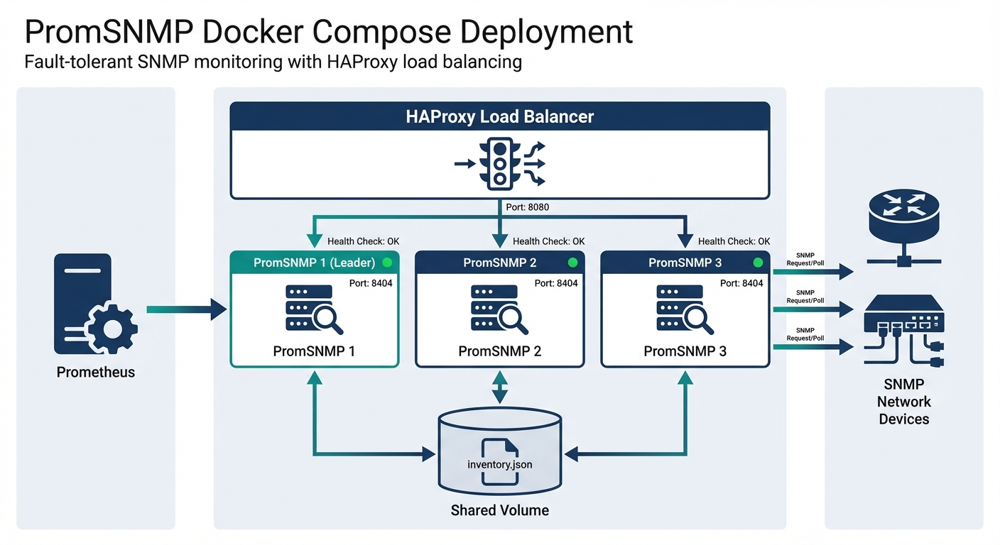

<details>
<summary>View Mermaid Diagram</summary>

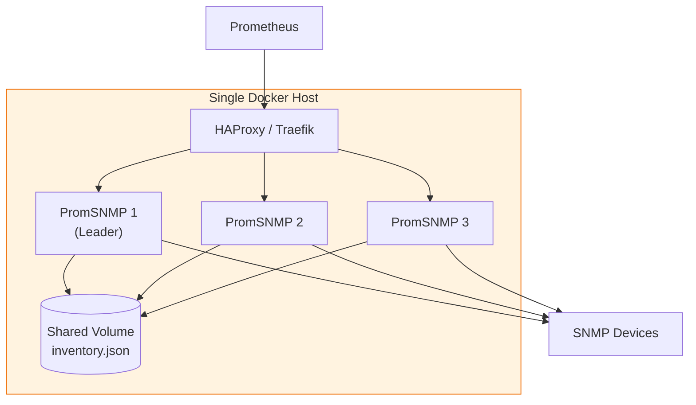
</details>

**Characteristics:**
- All containers on single host (or Swarm cluster)
- Shared Docker volume for inventory
- Static leader assignment via environment variable
- Simple health checks
- Manual scaling

**Documentation:** [deployment-docker.md](deployment-docker.md)

---

### Kubernetes

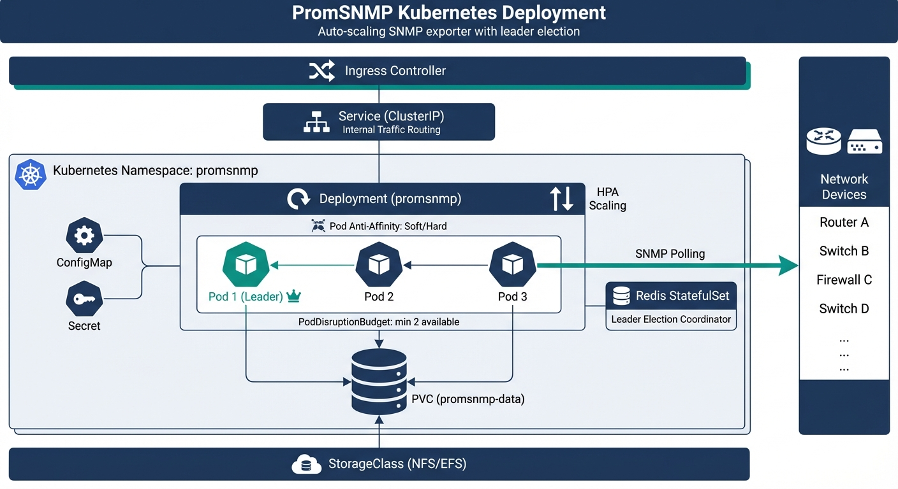

<details>
<summary>View Mermaid Diagram</summary>

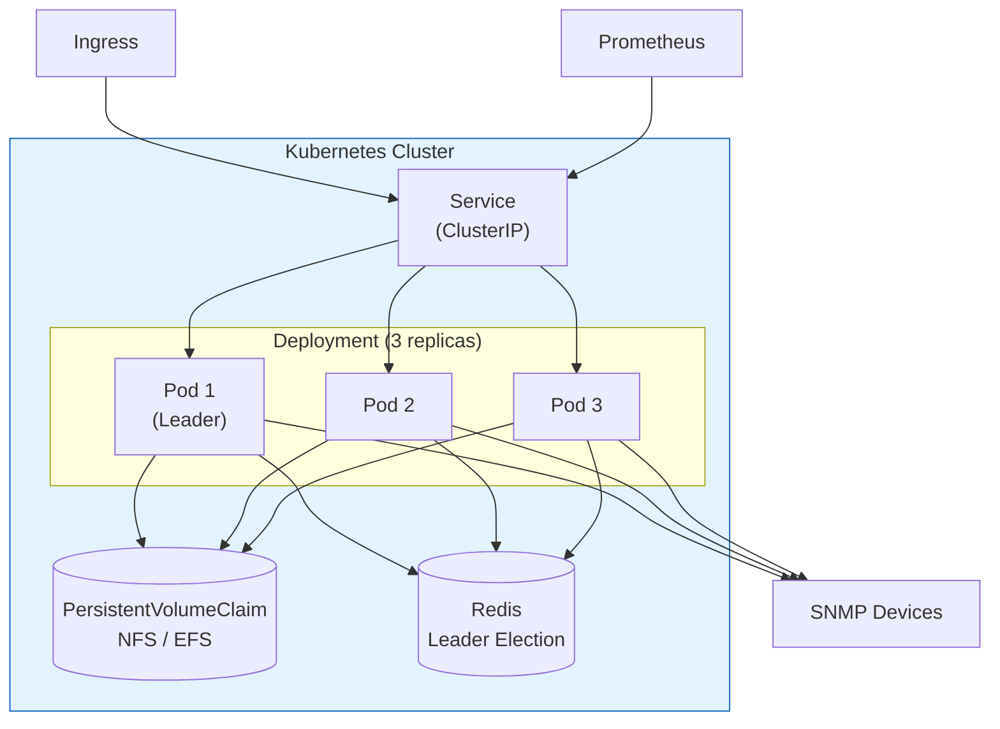
</details>

**Characteristics:**
- Native K8s deployment with replicas
- PersistentVolumeClaim for shared storage
- Redis or K8s lease for leader election
- Rolling updates with PodDisruptionBudget
- HorizontalPodAutoscaler support
- Full observability stack integration

**Documentation:** [deployment-kubernetes.md](deployment-kubernetes.md)

---

### Cloud Manager

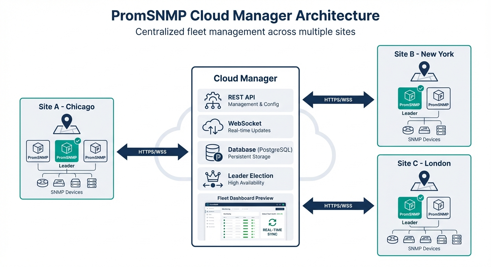

<details>
<summary>View Mermaid Diagram</summary>

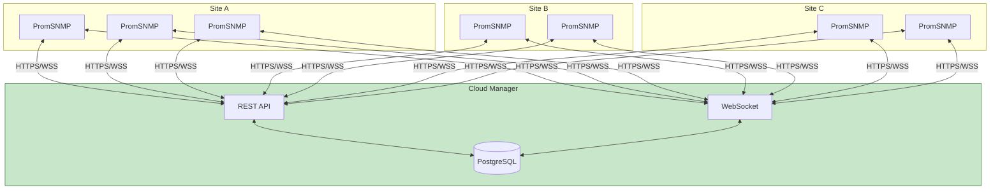
</details>

**Characteristics:**
- Centralized management across sites
- Real-time sync via WebSocket
- Built-in leader election per site
- Fleet-wide visibility and control
- Offline resilience with local cache
- Full audit trail

**Documentation:** [cloud-manager-architecture.md](cloud-manager-architecture.md)

---

## Quick Start by Deployment Type

### Docker Compose (Fastest)

```bash
# Clone and start
git clone https://github.com/pbrane/promsnmp-metrics.git
cd promsnmp-metrics/deployment

# Start the stack
docker compose up -d

# Access
# - PromSNMP: http://localhost:8080
# - Prometheus: http://localhost:9090
# - Grafana: http://localhost:3000 (admin/admin)
```

### Kubernetes

```bash
# Apply manifests
kubectl apply -f https://raw.githubusercontent.com/pbrane/promsnmp-metrics/main/deploy/kubernetes/namespace.yaml
kubectl apply -f https://raw.githubusercontent.com/pbrane/promsnmp-metrics/main/deploy/kubernetes/promsnmp.yaml

# Check status
kubectl get pods -n promsnmp -w
```

### Cloud Manager

```bash
# Deploy manager (Helm)
helm repo add promsnmp https://charts.promsnmp.io
helm install promsnmp-manager promsnmp/manager -n promsnmp-system

# Register a site
curl -X POST https://manager.example.com/api/v1/sites \
  -H "Authorization: Bearer $TOKEN" \
  -d '{"id": "site-01", "label": "Primary DC"}'

# Deploy instances at site
export MANAGER_URL=https://manager.example.com
export SITE_ID=site-01
docker compose -f docker-compose.managed.yml up -d
```

---

## Choosing the Right Option

### Use Docker Compose when:
- Running a single site with < 500 devices
- Limited Kubernetes expertise
- Development or testing environments
- Quick proof-of-concept needed
- Single host is sufficient

### Use Kubernetes when:
- Running a single site with 500+ devices
- Already have K8s infrastructure
- Need auto-scaling capabilities
- Want native rolling updates
- Require pod disruption budgets
- Integrating with existing K8s monitoring

### Use Cloud Manager when:
- Managing multiple geographic sites
- Need centralized fleet visibility
- Require audit trails for compliance
- Want automatic leader election across sites
- Building a managed service (MSP)
- Need offline resilience at sites

---

## Common Components

All deployment options share these core concepts:

### Leader Election

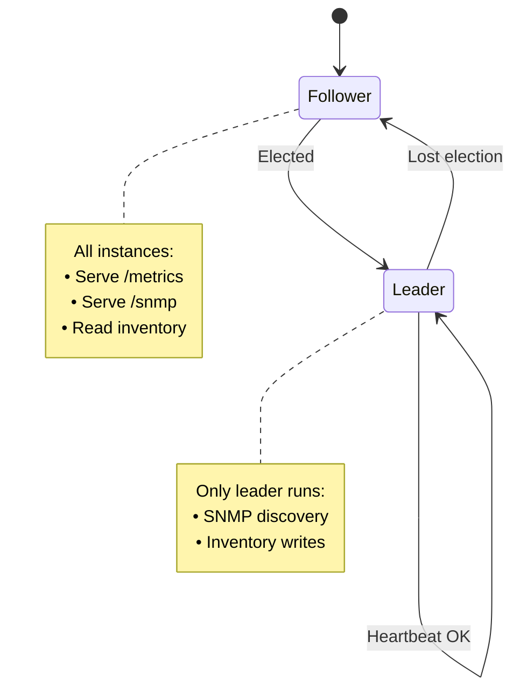

### Inventory Synchronization

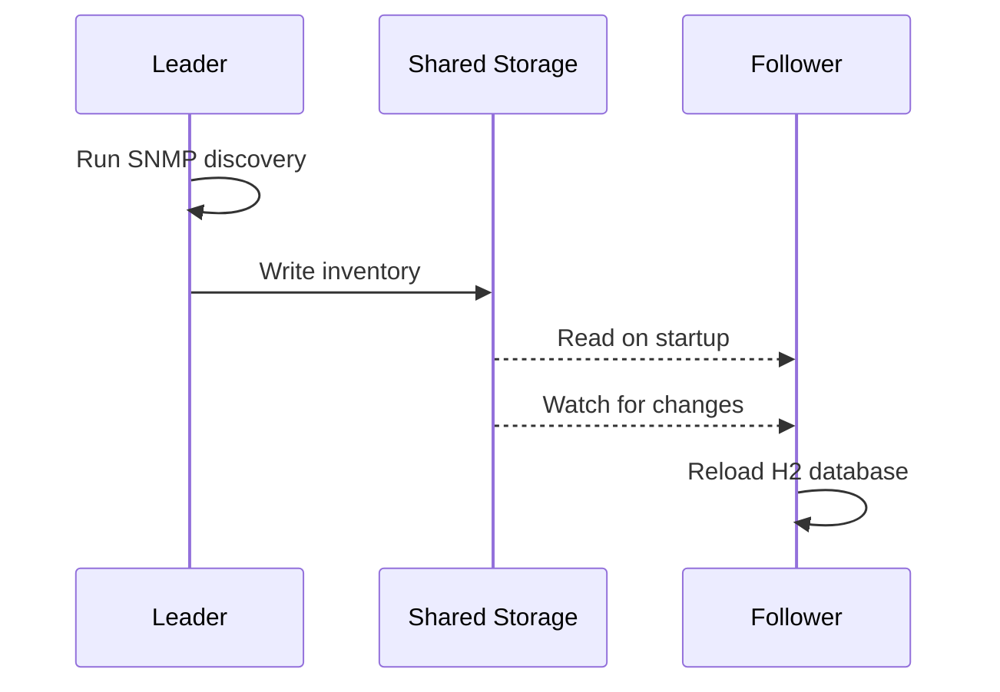

### Health Checks

All deployments should implement:

| Check | Endpoint | Purpose |
|-------|----------|---------|
| Liveness | `/actuator/health/liveness` | Restart if unhealthy |
| Readiness | `/actuator/health/readiness` | Traffic routing |
| Startup | `/actuator/health` | Initial boot |

---

## Upgrade Strategies

### Rolling Update (All Options)

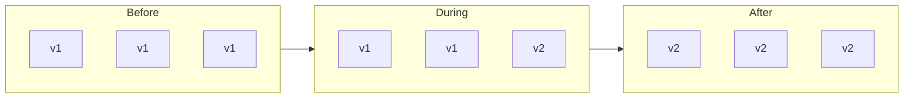

### Blue-Green (K8s & Cloud Manager)

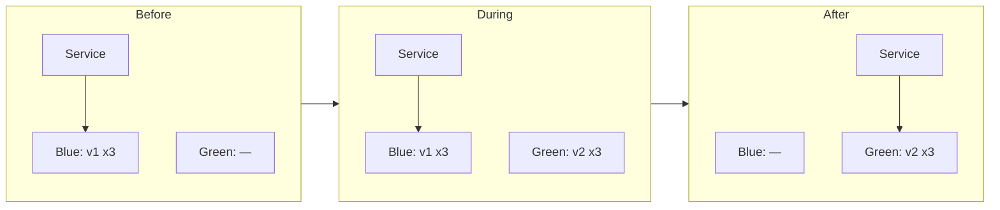

---

## Monitoring Integration

### Prometheus Configuration

All deployments expose metrics that Prometheus can scrape:

```yaml
scrape_configs:
  - job_name: 'promsnmp'
    # For Docker Compose
    static_configs:
      - targets: ['promsnmp-1:8080', 'promsnmp-2:8080', 'promsnmp-3:8080']

    # For Kubernetes (service discovery)
    kubernetes_sd_configs:
      - role: pod
        namespaces:
          names: ['promsnmp']

    # For Cloud Manager (HTTP SD)
    http_sd_configs:
      - url: 'http://promsnmp:8080/targets'
```

### Key Metrics

```promql
# Instance health
up{job="promsnmp"}

# Cache efficiency
rate(cache_gets_total{cache="metrics",result="hit"}[5m]) /
rate(cache_gets_total{cache="metrics"}[5m])

# SNMP query latency
histogram_quantile(0.99, rate(snmp_query_duration_seconds_bucket[5m]))

# Device count
promsnmp_inventory_device_count
```

---

## Security Considerations

| Aspect | Docker | Kubernetes | Cloud Manager |
|--------|--------|------------|---------------|
| **Network** | Docker network | NetworkPolicy | TLS + WAF |
| **Secrets** | .env file | K8s Secrets | Vault / KMS |
| **RBAC** | N/A | K8s RBAC | API tokens |
| **Encryption** | Volume encryption | PVC encryption | At-rest + in-transit |

---

## Next Steps

1. **Choose your deployment type** based on the comparison above
2. **Read the detailed guide** for your chosen option:
   - [Docker Compose Deployment](deployment-docker.md)
   - [Kubernetes Deployment](deployment-kubernetes.md)
   - [Cloud Manager Architecture](cloud-manager-architecture.md)
3. **Set up monitoring** using the Prometheus configuration
4. **Configure alerting** for critical metrics

---

## Document Index

| Document | Description |
|----------|-------------|
| [deployment-docker.md](deployment-docker.md) | Docker Compose deployment guide |
| [deployment-kubernetes.md](deployment-kubernetes.md) | Kubernetes deployment guide |
| [cloud-manager-architecture.md](cloud-manager-architecture.md) | Cloud Manager specification |
| [deployment-plan-fault-tolerant.md](deployment-plan-fault-tolerant.md) | Original comprehensive plan |
