# Fault-Tolerant Multi-Container PromSNMP Deployment Plan

## Executive Summary

This document outlines a production deployment architecture for running multiple PromSNMP containers at a site with fault tolerance and zero-downtime upgrades. The design addresses PromSNMP's stateful components: in-memory H2 database, encrypted inventory file, Caffeine metrics cache, and scheduled discovery operations.

---

## Architecture Overview

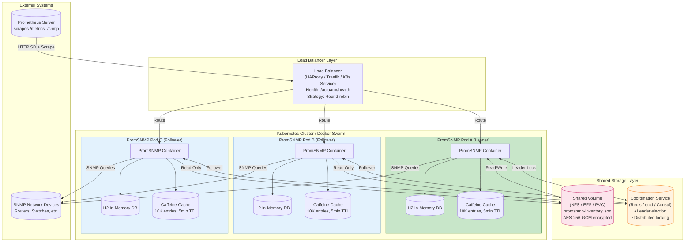

---

## Data Flow Diagram

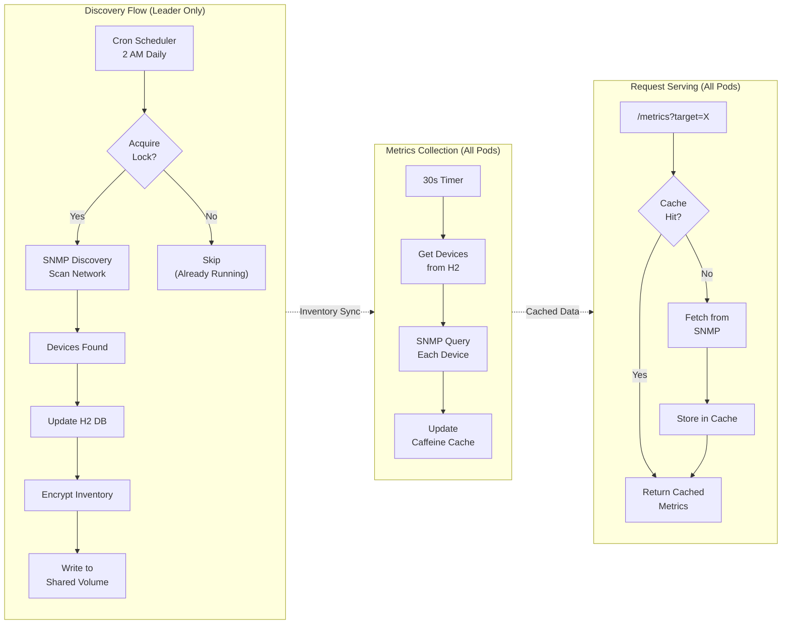

---

## Component Design

### 1. Shared Inventory Storage

**Problem:** Each PromSNMP instance maintains an in-memory H2 database that is lost on restart. The encrypted inventory file (`promsnmp-inventory.json`) is the source of truth but has no built-in distributed coordination.

**Solution:** Mount a shared persistent volume for the inventory file.

```yaml
# Kubernetes PersistentVolumeClaim
apiVersion: v1
kind: PersistentVolumeClaim
metadata:
  name: promsnmp-inventory-pvc
spec:
  accessModes:
    - ReadWriteMany  # Critical: allows multiple pods to mount
  storageClassName: nfs-client  # Or AWS EFS, Azure Files, etc.
  resources:
    requests:
      storage: 1Gi
```

**Volume Mount in Deployment:**
```yaml
volumeMounts:
  - name: inventory-storage
    mountPath: /app/data
volumes:
  - name: inventory-storage
    persistentVolumeClaim:
      claimName: promsnmp-inventory-pvc
```

**File Locking Strategy:**
Since multiple containers may write to the inventory file, implement application-level coordination:

Option A: **Single Writer Pattern** (Recommended)
- Only the leader instance performs discovery and writes inventory
- Followers read-only from the shared file
- Use leader election (see Section 3)

Option B: **Optimistic Locking with Version Check**
- Add version field to inventory JSON
- Check-and-set before write
- Retry on conflict

---

### 2. Instance Configuration

All instances share the same configuration via ConfigMap and Secrets:

```yaml
apiVersion: v1
kind: ConfigMap
metadata:
  name: promsnmp-config
data:
  PROM_INV_FILE: "/app/data/promsnmp-inventory.json"
  PROM_SITE_ID: "chicago-pop-01"
  PROM_SITE_LABEL: "Chicago POP"
  PROM_TENANT_ID: "acme-corp"

  # Disable startup discovery on followers (leader only)
  DISCOVERY_ON_START: "false"
  DISCOVERY_CRON: "0 0 2 * * *"
  DISCOVERY_TZ: "America/New_York"

  # Metrics collection settings
  COLLECTION_INTERVAL: "30000"
  CACHE_EXP_MILLIS: "300000"
  CACHE_ENTRY_CNT: "10000"
---
apiVersion: v1
kind: Secret
metadata:
  name: promsnmp-secrets
type: Opaque
stringData:
  PROM_ENCRYPT_KEY: "your-16-byte-key-here"  # Must be identical across all instances
```

---

### 3. Leader Election for Discovery Coordination

**Problem:** Without coordination, all instances run discovery simultaneously, causing:
- Duplicate SNMP queries to devices (increased load)
- Race conditions writing inventory file
- Wasted compute resources

**Solution:** Implement leader election where only the leader runs discovery.

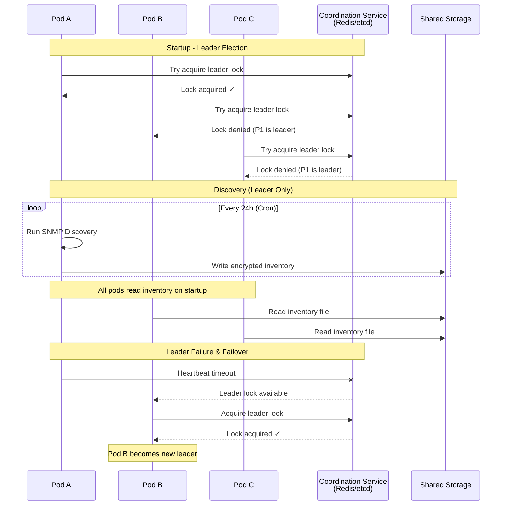

#### Option A: Kubernetes Native Leader Election

```yaml
apiVersion: apps/v1
kind: Deployment
metadata:
  name: promsnmp
spec:
  replicas: 3
  template:
    spec:
      containers:
        - name: promsnmp
          image: ghcr.io/pbrane/promsnmp-metrics:latest
          env:
            - name: POD_NAME
              valueFrom:
                fieldRef:
                  fieldPath: metadata.name

        # Sidecar for leader election
        - name: leader-elector
          image: registry.k8s.io/leader-elector:0.5
          args:
            - --election=promsnmp-discovery
            - --http=0.0.0.0:4040
            - --election-namespace=$(POD_NAMESPACE)
          env:
            - name: POD_NAMESPACE
              valueFrom:
                fieldRef:
                  fieldPath: metadata.namespace
```

**Application Integration:**
Add a startup script that checks leadership before enabling discovery:

```bash
#!/bin/bash
# entrypoint.sh

# Check if we're the leader
LEADER=$(curl -s http://localhost:4040 | jq -r '.name')
POD_NAME=${POD_NAME:-$(hostname)}

if [ "$LEADER" == "$POD_NAME" ]; then
  export DISCOVERY_ON_START="true"
  export DISCOVERY_CRON="0 0 2 * * *"
else
  export DISCOVERY_ON_START="false"
  export DISCOVERY_CRON="-"  # Disable cron entirely
fi

exec java -jar promsnmp.jar
```

#### Option B: Redis-Based Distributed Lock

For non-Kubernetes environments or more flexible control:

```yaml
# docker-compose.yml
services:
  redis:
    image: redis:7-alpine
    ports:
      - "6379:6379"
    volumes:
      - redis-data:/data
    command: redis-server --appendonly yes

  promsnmp-leader:
    image: ghcr.io/pbrane/promsnmp-metrics:latest
    environment:
      - REDIS_URL=redis://redis:6379
      - PROMSNMP_ROLE=leader
      - DISCOVERY_ON_START=true
      - DISCOVERY_CRON=0 0 2 * * *
    depends_on:
      - redis
    volumes:
      - inventory:/app/data

  promsnmp-follower:
    image: ghcr.io/pbrane/promsnmp-metrics:latest
    environment:
      - REDIS_URL=redis://redis:6379
      - PROMSNMP_ROLE=follower
      - DISCOVERY_ON_START=false
      - DISCOVERY_CRON=-
    depends_on:
      - redis
    volumes:
      - inventory:/app/data
    deploy:
      replicas: 2

volumes:
  inventory:
    driver: local
    driver_opts:
      type: nfs
      o: addr=nfs-server.local,rw
      device: ":/exports/promsnmp"
  redis-data:
```

---

### 4. Load Balancer Configuration

**Prometheus Service Discovery:**
The load balancer should distribute `/metrics` and `/snmp` scrape requests across all healthy instances.

```yaml
# Kubernetes Service
apiVersion: v1
kind: Service
metadata:
  name: promsnmp
  annotations:
    prometheus.io/scrape: "true"
    prometheus.io/port: "8080"
    prometheus.io/path: "/metrics"
spec:
  type: ClusterIP
  ports:
    - name: http
      port: 8080
      targetPort: 8080
  selector:
    app: promsnmp
```

**HAProxy Configuration (non-K8s):**

```haproxy
frontend promsnmp_frontend
    bind *:8080
    default_backend promsnmp_backend

    # Health check endpoint
    option httpchk GET /actuator/health
    http-check expect status 200

backend promsnmp_backend
    balance roundrobin
    option httpchk GET /actuator/health
    http-check expect status 200

    server promsnmp1 promsnmp-1:8080 check inter 5s fall 3 rise 2
    server promsnmp2 promsnmp-2:8080 check inter 5s fall 3 rise 2
    server promsnmp3 promsnmp-3:8080 check inter 5s fall 3 rise 2
```

**Prometheus Configuration:**

```yaml
# prometheus.yml
scrape_configs:
  - job_name: 'promsnmp'
    http_sd_configs:
      - url: 'http://promsnmp:8080/targets'
        refresh_interval: 30s

    relabel_configs:
      # Use the target from SD response
      - source_labels: [__address__]
        target_label: __param_target
      # Override scrape address to go through load balancer
      - target_label: __address__
        replacement: promsnmp:8080
```

---

### 5. Health Checks and Readiness Probes

```yaml
apiVersion: apps/v1
kind: Deployment
metadata:
  name: promsnmp
spec:
  template:
    spec:
      containers:
        - name: promsnmp
          image: ghcr.io/pbrane/promsnmp-metrics:latest
          ports:
            - containerPort: 8080

          # Readiness: Only route traffic when inventory is loaded
          readinessProbe:
            httpGet:
              path: /actuator/health/readiness
              port: 8080
            initialDelaySeconds: 10
            periodSeconds: 5
            failureThreshold: 3

          # Liveness: Restart if application is unhealthy
          livenessProbe:
            httpGet:
              path: /actuator/health/liveness
              port: 8080
            initialDelaySeconds: 30
            periodSeconds: 10
            failureThreshold: 3

          # Startup: Give time for initial inventory load
          startupProbe:
            httpGet:
              path: /actuator/health
              port: 8080
            initialDelaySeconds: 5
            periodSeconds: 5
            failureThreshold: 30  # 150 seconds max startup time
```

---

## Seamless Upgrade Strategy

### Upgrade Strategy Comparison

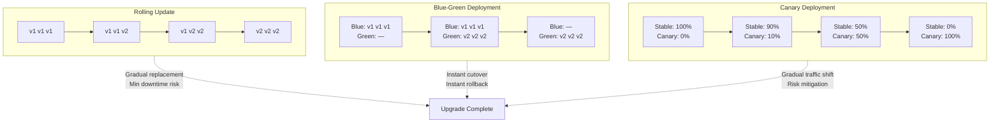

### Rolling Update (Kubernetes)

```yaml
apiVersion: apps/v1
kind: Deployment
metadata:
  name: promsnmp
spec:
  replicas: 3
  strategy:
    type: RollingUpdate
    rollingUpdate:
      maxUnavailable: 1      # At most 1 pod unavailable during update
      maxSurge: 1            # At most 1 extra pod during update

  template:
    spec:
      terminationGracePeriodSeconds: 60  # Allow time for graceful shutdown
      containers:
        - name: promsnmp
          lifecycle:
            preStop:
              exec:
                # Graceful shutdown: complete in-flight requests
                command: ["/bin/sh", "-c", "sleep 10"]
```

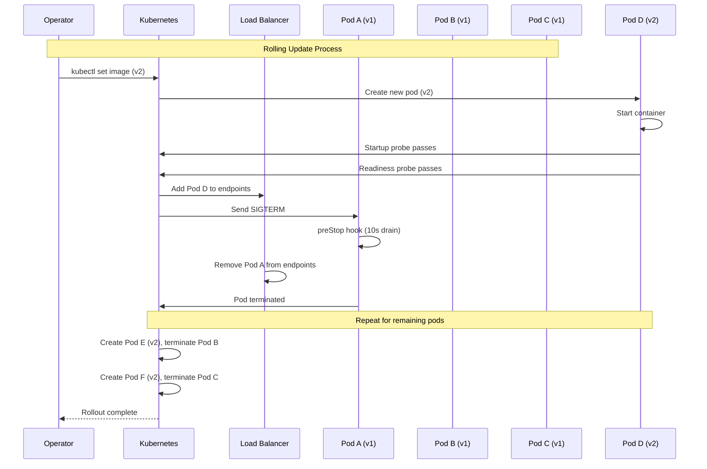

**Upgrade Process:**

1. **Pre-upgrade checks:**
   ```bash
   # Verify all pods healthy
   kubectl get pods -l app=promsnmp

   # Check current inventory state
   kubectl exec -it promsnmp-0 -- curl localhost:8080/promsnmp/inventory | jq '.devices | length'
   ```

2. **Trigger rolling update:**
   ```bash
   # Update image tag
   kubectl set image deployment/promsnmp promsnmp=ghcr.io/pbrane/promsnmp-metrics:v0.0.10

   # Or apply updated manifest
   kubectl apply -f promsnmp-deployment.yaml
   ```

3. **Monitor rollout:**
   ```bash
   kubectl rollout status deployment/promsnmp

   # Watch pod transitions
   kubectl get pods -l app=promsnmp -w
   ```

4. **Rollback if needed:**
   ```bash
   kubectl rollout undo deployment/promsnmp
   ```

### Blue-Green Deployment (Zero-Downtime)

For critical environments requiring instant rollback:

```yaml
# Blue deployment (current)
apiVersion: apps/v1
kind: Deployment
metadata:
  name: promsnmp-blue
  labels:
    app: promsnmp
    version: blue
spec:
  replicas: 3
  selector:
    matchLabels:
      app: promsnmp
      version: blue
---
# Green deployment (new version)
apiVersion: apps/v1
kind: Deployment
metadata:
  name: promsnmp-green
  labels:
    app: promsnmp
    version: green
spec:
  replicas: 3
  selector:
    matchLabels:
      app: promsnmp
      version: green
---
# Service points to active deployment
apiVersion: v1
kind: Service
metadata:
  name: promsnmp
spec:
  selector:
    app: promsnmp
    version: blue  # Switch to 'green' to cutover
  ports:
    - port: 8080
```

**Blue-Green Cutover Process:**

```bash
# 1. Deploy green with new version
kubectl apply -f promsnmp-green.yaml

# 2. Wait for green pods to be ready
kubectl rollout status deployment/promsnmp-green

# 3. Verify green is healthy
kubectl exec -it $(kubectl get pod -l version=green -o name | head -1) -- \
  curl -s localhost:8080/actuator/health

# 4. Switch traffic to green
kubectl patch service promsnmp -p '{"spec":{"selector":{"version":"green"}}}'

# 5. Verify traffic is flowing to green
kubectl logs -l version=green --tail=10

# 6. Scale down blue (keep for rollback)
kubectl scale deployment promsnmp-blue --replicas=0

# 7. (Later) Delete blue deployment
kubectl delete deployment promsnmp-blue
```

### Canary Deployment

For gradual rollout with traffic splitting:

```yaml
# Istio VirtualService for canary
apiVersion: networking.istio.io/v1beta1
kind: VirtualService
metadata:
  name: promsnmp
spec:
  hosts:
    - promsnmp
  http:
    - route:
        - destination:
            host: promsnmp
            subset: stable
          weight: 90
        - destination:
            host: promsnmp
            subset: canary
          weight: 10
---
apiVersion: networking.istio.io/v1beta1
kind: DestinationRule
metadata:
  name: promsnmp
spec:
  host: promsnmp
  subsets:
    - name: stable
      labels:
        version: v0.0.9
    - name: canary
      labels:
        version: v0.0.10
```

---

## Failure Scenarios and Recovery

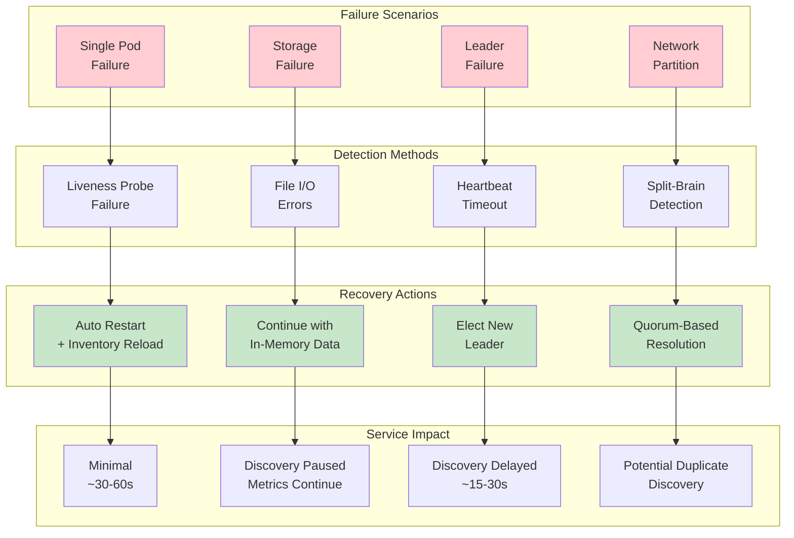

### Scenario 1: Single Pod Failure

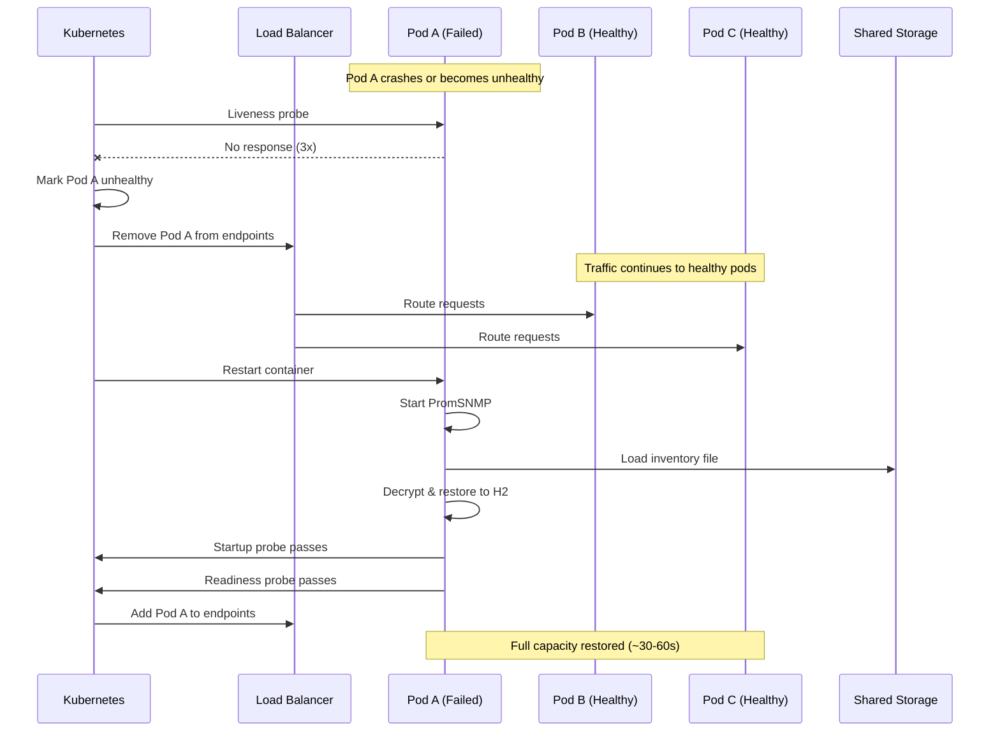

**Detection:** Kubernetes liveness probe fails after 3 consecutive checks.

**Automatic Recovery:**
1. Kubernetes marks pod as unhealthy
2. Service removes pod from endpoints (no traffic routed)
3. Kubernetes restarts the pod
4. Pod loads inventory from shared file on startup
5. Readiness probe passes, traffic resumes

**Impact:** Minimal - other pods handle load during restart (~30-60 seconds).

### Scenario 2: Shared Storage Failure

**Detection:** Inventory file read/write failures.

**Mitigation:**
```yaml
# Use StorageClass with replication
apiVersion: storage.k8s.io/v1
kind: StorageClass
metadata:
  name: promsnmp-storage
provisioner: kubernetes.io/aws-ebs
parameters:
  type: io1
  iopsPerGB: "10"
reclaimPolicy: Retain
volumeBindingMode: WaitForFirstConsumer
```

**Recovery:**
1. Each pod continues operating with in-memory H2 data
2. Metrics collection continues (cache serves requests)
3. Discovery pauses until storage recovers
4. On storage recovery, trigger inventory sync:
   ```bash
   kubectl exec -it promsnmp-leader -- curl -X POST localhost:8080/promsnmp/inventory
   ```

### Scenario 3: Leader Failure

**Detection:** Leader election timeout (typically 15-30 seconds).

**Automatic Recovery:**
1. Leader election service detects leader heartbeat timeout
2. New leader is elected from healthy followers
3. New leader enables discovery scheduling
4. Discovery runs on next scheduled interval

**Manual Intervention (if needed):**
```bash
# Force leader election
kubectl delete pod promsnmp-leader-xyz

# Or manually trigger discovery on any pod
kubectl exec -it promsnmp-follower-abc -- \
  curl -X POST 'localhost:8080/promsnmp/discovery?scheduleNow=true'
```

### Scenario 4: Network Partition

**Detection:** Split-brain where multiple pods believe they are leader.

**Prevention:**
- Use quorum-based leader election (etcd, Consul)
- Require majority consensus for leadership

**Recovery:**
```bash
# Check which pods are acting as leader
for pod in $(kubectl get pods -l app=promsnmp -o name); do
  echo "$pod: $(kubectl exec $pod -- cat /tmp/is_leader 2>/dev/null || echo 'follower')"
done

# Force single leader by restarting all but one
kubectl delete pod promsnmp-1 promsnmp-2
```

---

## Monitoring and Alerting

### Key Metrics to Monitor

```yaml
# PrometheusRule for PromSNMP alerts
apiVersion: monitoring.coreos.com/v1
kind: PrometheusRule
metadata:
  name: promsnmp-alerts
spec:
  groups:
    - name: promsnmp
      rules:
        # Alert if less than 2 pods are ready
        - alert: PromSNMPLowReplicas
          expr: |
            sum(kube_deployment_status_replicas_ready{deployment="promsnmp"}) < 2
          for: 5m
          labels:
            severity: warning
          annotations:
            summary: "PromSNMP has fewer than 2 ready replicas"

        # Alert if no leader is elected
        - alert: PromSNMPNoLeader
          expr: |
            sum(promsnmp_leader_election_is_leader) == 0
          for: 10m
          labels:
            severity: critical
          annotations:
            summary: "No PromSNMP instance is acting as discovery leader"

        # Alert if cache hit rate drops
        - alert: PromSNMPCacheHitRateLow
          expr: |
            rate(cache_gets_total{cache="metrics",result="hit"}[5m])
            /
            rate(cache_gets_total{cache="metrics"}[5m]) < 0.5
          for: 15m
          labels:
            severity: warning
          annotations:
            summary: "PromSNMP cache hit rate below 50%"

        # Alert if discovery hasn't run recently
        - alert: PromSNMPDiscoveryStale
          expr: |
            time() - promsnmp_last_discovery_timestamp > 86400 * 2
          for: 1h
          labels:
            severity: warning
          annotations:
            summary: "PromSNMP discovery hasn't run in over 48 hours"
```

### Grafana Dashboard Queries

```promql
# Active PromSNMP instances
sum(up{job="promsnmp"})

# Inventory device count (should be consistent across instances)
promsnmp_inventory_device_count

# Discovery success rate
rate(promsnmp_discovery_success_total[1h])
/
rate(promsnmp_discovery_attempts_total[1h])

# SNMP query latency p99
histogram_quantile(0.99, rate(promsnmp_snmp_query_duration_seconds_bucket[5m]))

# Cache efficiency
rate(cache_gets_total{cache="metrics",result="hit"}[5m])
/
rate(cache_gets_total{cache="metrics"}[5m])
```

---

## Complete Kubernetes Deployment

```yaml
# promsnmp-deployment.yaml
---
apiVersion: v1
kind: Namespace
metadata:
  name: monitoring
---
apiVersion: v1
kind: ConfigMap
metadata:
  name: promsnmp-config
  namespace: monitoring
data:
  PROM_INV_FILE: "/app/data/promsnmp-inventory.json"
  PROM_SITE_ID: "site-001"
  PROM_SITE_LABEL: "Primary Data Center"
  PROM_TENANT_ID: "tenant-001"
  DISCOVERY_ON_START: "false"
  DISCOVERY_CRON: "0 0 2 * * *"
  DISCOVERY_TZ: "America/New_York"
  COLLECTION_INTERVAL: "30000"
  CACHE_EXP_MILLIS: "300000"
  CACHE_ENTRY_CNT: "10000"
---
apiVersion: v1
kind: Secret
metadata:
  name: promsnmp-secrets
  namespace: monitoring
type: Opaque
stringData:
  PROM_ENCRYPT_KEY: "change-me-16byte"
---
apiVersion: v1
kind: PersistentVolumeClaim
metadata:
  name: promsnmp-inventory
  namespace: monitoring
spec:
  accessModes:
    - ReadWriteMany
  storageClassName: nfs-client
  resources:
    requests:
      storage: 1Gi
---
apiVersion: apps/v1
kind: Deployment
metadata:
  name: promsnmp
  namespace: monitoring
  labels:
    app: promsnmp
spec:
  replicas: 3
  selector:
    matchLabels:
      app: promsnmp
  strategy:
    type: RollingUpdate
    rollingUpdate:
      maxUnavailable: 1
      maxSurge: 1
  template:
    metadata:
      labels:
        app: promsnmp
      annotations:
        prometheus.io/scrape: "true"
        prometheus.io/port: "8080"
        prometheus.io/path: "/actuator/prometheus"
    spec:
      terminationGracePeriodSeconds: 60

      containers:
        - name: promsnmp
          image: ghcr.io/pbrane/promsnmp-metrics:latest
          imagePullPolicy: Always

          ports:
            - name: http
              containerPort: 8080
              protocol: TCP

          envFrom:
            - configMapRef:
                name: promsnmp-config
            - secretRef:
                name: promsnmp-secrets

          env:
            - name: POD_NAME
              valueFrom:
                fieldRef:
                  fieldPath: metadata.name

          resources:
            requests:
              memory: "512Mi"
              cpu: "250m"
            limits:
              memory: "1Gi"
              cpu: "1000m"

          volumeMounts:
            - name: inventory
              mountPath: /app/data

          readinessProbe:
            httpGet:
              path: /actuator/health/readiness
              port: 8080
            initialDelaySeconds: 10
            periodSeconds: 5
            failureThreshold: 3

          livenessProbe:
            httpGet:
              path: /actuator/health/liveness
              port: 8080
            initialDelaySeconds: 30
            periodSeconds: 10
            failureThreshold: 3

          startupProbe:
            httpGet:
              path: /actuator/health
              port: 8080
            initialDelaySeconds: 5
            periodSeconds: 5
            failureThreshold: 30

          lifecycle:
            preStop:
              exec:
                command: ["/bin/sh", "-c", "sleep 10"]

      volumes:
        - name: inventory
          persistentVolumeClaim:
            claimName: promsnmp-inventory
---
apiVersion: v1
kind: Service
metadata:
  name: promsnmp
  namespace: monitoring
  labels:
    app: promsnmp
spec:
  type: ClusterIP
  ports:
    - name: http
      port: 8080
      targetPort: 8080
      protocol: TCP
  selector:
    app: promsnmp
---
apiVersion: policy/v1
kind: PodDisruptionBudget
metadata:
  name: promsnmp-pdb
  namespace: monitoring
spec:
  minAvailable: 2
  selector:
    matchLabels:
      app: promsnmp
```

---

## Docker Compose Alternative (Non-Kubernetes)

```yaml
# docker-compose.yml
version: "3.8"

services:
  promsnmp-1:
    image: ghcr.io/pbrane/promsnmp-metrics:latest
    container_name: promsnmp-1
    environment:
      - PROM_INV_FILE=/app/data/promsnmp-inventory.json
      - PROM_ENCRYPT_KEY=${PROM_ENCRYPT_KEY}
      - PROM_SITE_ID=site-001
      - DISCOVERY_ON_START=true
      - DISCOVERY_CRON=0 0 2 * * *
    volumes:
      - inventory-data:/app/data
    networks:
      - promsnmp-net
    healthcheck:
      test: ["CMD", "curl", "-f", "http://localhost:8080/actuator/health"]
      interval: 10s
      timeout: 5s
      retries: 3
    deploy:
      resources:
        limits:
          memory: 1G
        reservations:
          memory: 512M

  promsnmp-2:
    image: ghcr.io/pbrane/promsnmp-metrics:latest
    container_name: promsnmp-2
    environment:
      - PROM_INV_FILE=/app/data/promsnmp-inventory.json
      - PROM_ENCRYPT_KEY=${PROM_ENCRYPT_KEY}
      - PROM_SITE_ID=site-001
      - DISCOVERY_ON_START=false
      - DISCOVERY_CRON=-
    volumes:
      - inventory-data:/app/data
    networks:
      - promsnmp-net
    healthcheck:
      test: ["CMD", "curl", "-f", "http://localhost:8080/actuator/health"]
      interval: 10s
      timeout: 5s
      retries: 3

  promsnmp-3:
    image: ghcr.io/pbrane/promsnmp-metrics:latest
    container_name: promsnmp-3
    environment:
      - PROM_INV_FILE=/app/data/promsnmp-inventory.json
      - PROM_ENCRYPT_KEY=${PROM_ENCRYPT_KEY}
      - PROM_SITE_ID=site-001
      - DISCOVERY_ON_START=false
      - DISCOVERY_CRON=-
    volumes:
      - inventory-data:/app/data
    networks:
      - promsnmp-net
    healthcheck:
      test: ["CMD", "curl", "-f", "http://localhost:8080/actuator/health"]
      interval: 10s
      timeout: 5s
      retries: 3

  haproxy:
    image: haproxy:2.8-alpine
    container_name: promsnmp-lb
    ports:
      - "8080:8080"
      - "8404:8404"  # Stats page
    volumes:
      - ./haproxy.cfg:/usr/local/etc/haproxy/haproxy.cfg:ro
    networks:
      - promsnmp-net
    depends_on:
      - promsnmp-1
      - promsnmp-2
      - promsnmp-3

volumes:
  inventory-data:
    driver: local
    driver_opts:
      type: nfs
      o: addr=${NFS_SERVER},rw,nolock
      device: ":${NFS_PATH}"

networks:
  promsnmp-net:
    driver: bridge
```

---

## Cloud Manager Architecture (Recommended)

An alternative to shared filesystem storage is a centralized cloud management service that acts as the source of truth for all PromSNMP instances across multiple sites.

### Architecture Overview

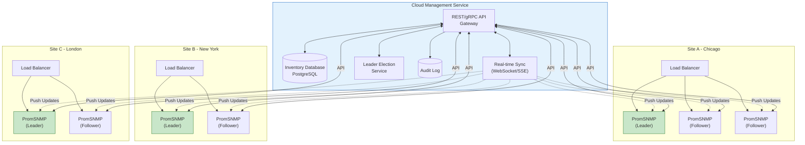

### Benefits Over Shared Filesystem

| Concern | NFS/EFS Approach | Cloud Manager Approach |
|---------|------------------|------------------------|
| **Inventory Storage** | Encrypted file on shared volume | Central database with API |
| **Leader Election** | External service (Redis/etcd) | Built into manager |
| **Multi-Site** | Separate storage per site | Single source of truth |
| **Conflict Resolution** | File locking (fragile) | Server-side merge logic |
| **Offline Operation** | Requires NFS availability | Local cache + sync on reconnect |
| **Audit Trail** | None | Full history in database |
| **Access Control** | Filesystem permissions | API tokens, RBAC |
| **Visibility** | Per-site only | Fleet-wide dashboard |

### Instance Lifecycle

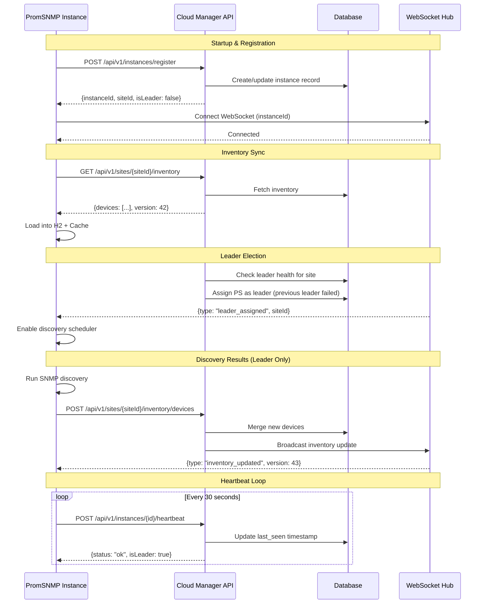

### API Design

#### Authentication

All API requests require a Bearer token:
```
Authorization: Bearer <site-api-token>
```

Tokens are scoped per-site with configurable permissions (read-only, read-write, admin).

#### Core Endpoints

##### Instance Management

```yaml
# Register a new instance
POST /api/v1/instances/register
Request:
  {
    "siteId": "chicago-pop-01",
    "hostname": "promsnmp-a1b2c3",
    "version": "0.0.10",
    "capabilities": ["snmpv1", "snmpv2c", "snmpv3"]
  }
Response:
  {
    "instanceId": "inst_abc123",
    "siteId": "chicago-pop-01",
    "isLeader": false,
    "inventoryVersion": 42,
    "config": {
      "discoveryEnabled": true,
      "discoveryCron": "0 0 2 * * *",
      "collectionInterval": 30000
    }
  }

# Heartbeat (every 30s)
POST /api/v1/instances/{instanceId}/heartbeat
Request:
  {
    "status": "healthy",
    "metrics": {
      "devicesMonitored": 150,
      "cacheHitRate": 0.94,
      "snmpQueriesPerMin": 300
    }
  }
Response:
  {
    "status": "ok",
    "isLeader": true,
    "inventoryVersion": 42,
    "configVersion": 5
  }

# Deregister instance (graceful shutdown)
DELETE /api/v1/instances/{instanceId}
```

##### Inventory Management

```yaml
# Get site inventory
GET /api/v1/sites/{siteId}/inventory
Query Parameters:
  - version: int (optional, for conditional fetch)
  - includeCredentials: bool (default: false, requires admin)
Response:
  {
    "version": 42,
    "updatedAt": "2024-01-15T10:30:00Z",
    "devices": [
      {
        "id": "dev_xyz789",
        "sysName": "core-rtr-01",
        "sysDescr": "Cisco IOS XR",
        "address": "10.0.1.1",
        "agents": [
          {
            "id": "agt_111",
            "type": "snmpv2c",
            "port": 161,
            "readCommunity": "****"  # Masked unless admin
          }
        ],
        "discoveredAt": "2024-01-10T08:00:00Z",
        "lastSeen": "2024-01-15T10:25:00Z"
      }
    ],
    "discoverySeeds": [
      {
        "id": "seed_001",
        "targets": ["10.0.1.0/24", "10.0.2.0/24"],
        "snmpConfig": { "version": 2, "readCommunity": "****" }
      }
    ]
  }

# Add devices (from discovery - leader only)
POST /api/v1/sites/{siteId}/inventory/devices
Request:
  {
    "devices": [
      {
        "sysName": "access-sw-05",
        "sysDescr": "Cisco Catalyst",
        "address": "10.0.1.50",
        "agents": [...]
      }
    ],
    "source": "discovery",
    "instanceId": "inst_abc123"
  }
Response:
  {
    "added": 1,
    "updated": 0,
    "unchanged": 0,
    "newVersion": 43
  }

# Remove device
DELETE /api/v1/sites/{siteId}/inventory/devices/{deviceId}

# Bulk import inventory
PUT /api/v1/sites/{siteId}/inventory
Request:
  {
    "devices": [...],
    "discoverySeeds": [...],
    "replaceAll": false  # true = replace, false = merge
  }
```

##### Discovery Seeds

```yaml
# List discovery seeds
GET /api/v1/sites/{siteId}/discovery-seeds

# Create discovery seed
POST /api/v1/sites/{siteId}/discovery-seeds
Request:
  {
    "targets": ["192.168.1.0/24"],
    "snmpConfig": {
      "version": 2,
      "readCommunity": "public"
    },
    "schedule": "0 0 2 * * *",
    "enabled": true
  }

# Trigger immediate discovery
POST /api/v1/sites/{siteId}/discovery-seeds/{seedId}/run

# Delete discovery seed
DELETE /api/v1/sites/{siteId}/discovery-seeds/{seedId}
```

##### Site & Fleet Management

```yaml
# List all sites
GET /api/v1/sites
Response:
  {
    "sites": [
      {
        "id": "chicago-pop-01",
        "label": "Chicago POP",
        "instanceCount": 3,
        "leaderInstanceId": "inst_abc123",
        "deviceCount": 150,
        "status": "healthy"
      }
    ]
  }

# Get site details
GET /api/v1/sites/{siteId}

# Create site
POST /api/v1/sites
Request:
  {
    "id": "london-dc-01",
    "label": "London Data Center",
    "config": {
      "timezone": "Europe/London",
      "minReplicas": 2
    }
  }

# Get fleet-wide health
GET /api/v1/fleet/health
Response:
  {
    "totalSites": 3,
    "healthySites": 3,
    "totalInstances": 7,
    "healthyInstances": 7,
    "totalDevices": 450,
    "alerts": []
  }
```

#### WebSocket Events

Connect to receive real-time updates:
```
WSS /api/v1/ws?instanceId={instanceId}&token={token}
```

##### Event Types

```yaml
# Inventory updated (broadcast to all site instances)
{
  "type": "inventory_updated",
  "siteId": "chicago-pop-01",
  "version": 43,
  "changeType": "device_added",  # device_added, device_removed, device_updated, full_sync
  "deviceIds": ["dev_xyz789"]
}

# Leader assignment
{
  "type": "leader_assigned",
  "siteId": "chicago-pop-01",
  "instanceId": "inst_abc123",
  "previousLeader": "inst_def456"
}

# Leader revoked (instance should stop discovery)
{
  "type": "leader_revoked",
  "siteId": "chicago-pop-01",
  "reason": "manual_override"  # manual_override, health_check_failed, instance_deregistered
}

# Configuration updated
{
  "type": "config_updated",
  "siteId": "chicago-pop-01",
  "configVersion": 6,
  "changes": ["discoveryCron", "collectionInterval"]
}

# Force inventory refresh
{
  "type": "refresh_inventory",
  "siteId": "chicago-pop-01",
  "reason": "admin_request"
}
```

### PromSNMP Client Integration

The PromSNMP instance needs a client to interact with the Cloud Manager:

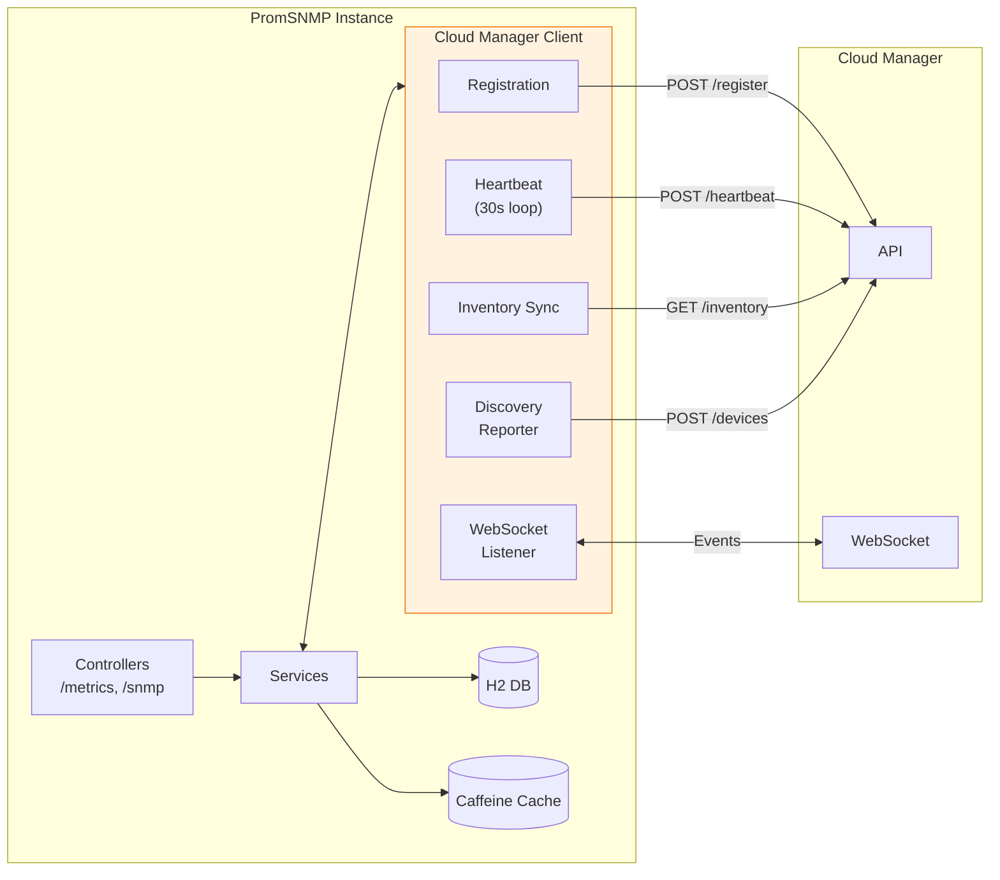

### Offline Operation & Resilience

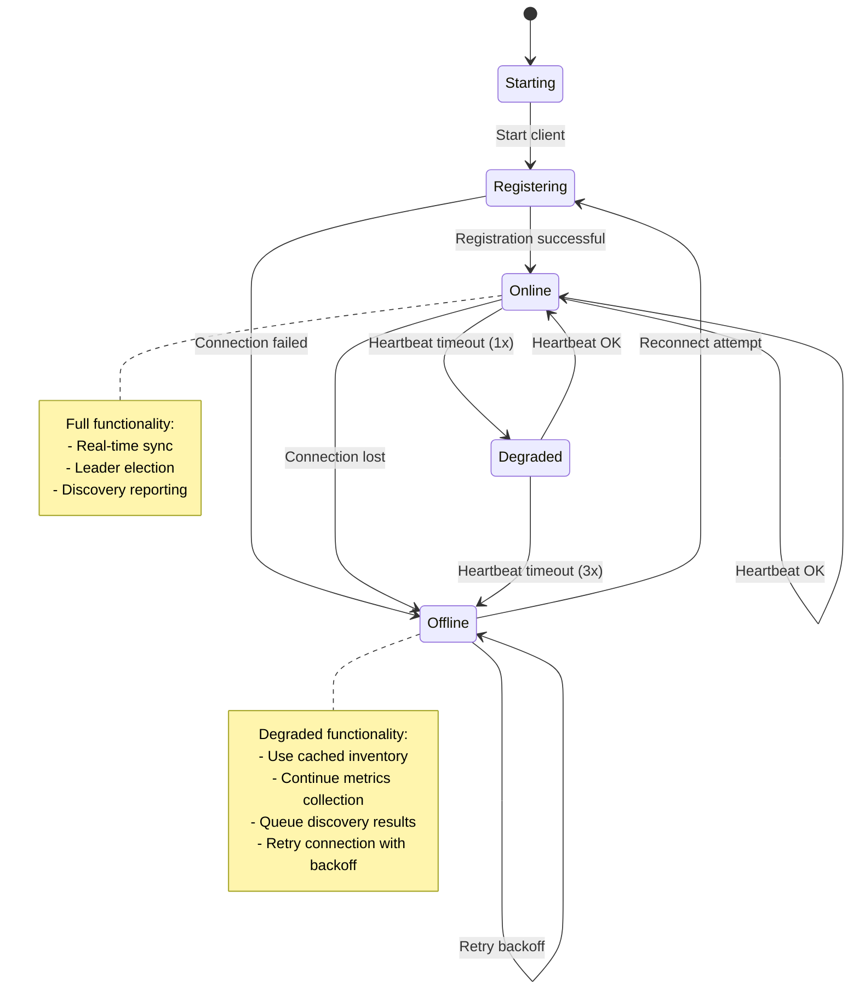

**Offline behavior:**
1. Instance continues serving metrics from local H2/cache
2. Discovery results queued locally (if leader)
3. Exponential backoff for reconnection (1s, 2s, 4s, ... max 5min)
4. On reconnect: sync queued data, refresh inventory

### Database Schema (PostgreSQL)

```sql
-- Sites table
CREATE TABLE sites (
    id VARCHAR(64) PRIMARY KEY,
    label VARCHAR(255) NOT NULL,
    config JSONB DEFAULT '{}',
    created_at TIMESTAMPTZ DEFAULT NOW(),
    updated_at TIMESTAMPTZ DEFAULT NOW()
);

-- Instances table
CREATE TABLE instances (
    id VARCHAR(64) PRIMARY KEY,
    site_id VARCHAR(64) REFERENCES sites(id),
    hostname VARCHAR(255) NOT NULL,
    version VARCHAR(32),
    is_leader BOOLEAN DEFAULT FALSE,
    status VARCHAR(32) DEFAULT 'unknown',
    last_heartbeat TIMESTAMPTZ,
    registered_at TIMESTAMPTZ DEFAULT NOW(),
    config JSONB DEFAULT '{}'
);

-- Devices table
CREATE TABLE devices (
    id VARCHAR(64) PRIMARY KEY,
    site_id VARCHAR(64) REFERENCES sites(id),
    sys_name VARCHAR(255),
    sys_descr TEXT,
    sys_contact VARCHAR(255),
    sys_location VARCHAR(255),
    discovered_at TIMESTAMPTZ,
    last_seen TIMESTAMPTZ,
    discovered_by VARCHAR(64) REFERENCES instances(id),
    metadata JSONB DEFAULT '{}'
);

-- Agents table
CREATE TABLE agents (
    id VARCHAR(64) PRIMARY KEY,
    device_id VARCHAR(64) REFERENCES devices(id) ON DELETE CASCADE,
    address INET NOT NULL,
    port INTEGER DEFAULT 161,
    version INTEGER NOT NULL,  -- 1, 2, 3
    config JSONB NOT NULL,     -- Community or USM credentials (encrypted)
    is_primary BOOLEAN DEFAULT FALSE,
    created_at TIMESTAMPTZ DEFAULT NOW()
);

-- Discovery seeds table
CREATE TABLE discovery_seeds (
    id VARCHAR(64) PRIMARY KEY,
    site_id VARCHAR(64) REFERENCES sites(id),
    targets TEXT[] NOT NULL,
    snmp_config JSONB NOT NULL,  -- Encrypted credentials
    schedule VARCHAR(64),
    enabled BOOLEAN DEFAULT TRUE,
    last_run TIMESTAMPTZ,
    created_at TIMESTAMPTZ DEFAULT NOW()
);

-- Inventory versions (for optimistic concurrency)
CREATE TABLE inventory_versions (
    site_id VARCHAR(64) PRIMARY KEY REFERENCES sites(id),
    version INTEGER DEFAULT 1,
    updated_at TIMESTAMPTZ DEFAULT NOW()
);

-- Audit log
CREATE TABLE audit_log (
    id BIGSERIAL PRIMARY KEY,
    site_id VARCHAR(64),
    instance_id VARCHAR(64),
    action VARCHAR(64) NOT NULL,
    entity_type VARCHAR(64),
    entity_id VARCHAR(64),
    details JSONB,
    created_at TIMESTAMPTZ DEFAULT NOW()
);

-- Indexes
CREATE INDEX idx_instances_site ON instances(site_id);
CREATE INDEX idx_instances_heartbeat ON instances(last_heartbeat);
CREATE INDEX idx_devices_site ON devices(site_id);
CREATE INDEX idx_agents_device ON agents(device_id);
CREATE INDEX idx_audit_site_time ON audit_log(site_id, created_at DESC);
```

### Deployment Architecture

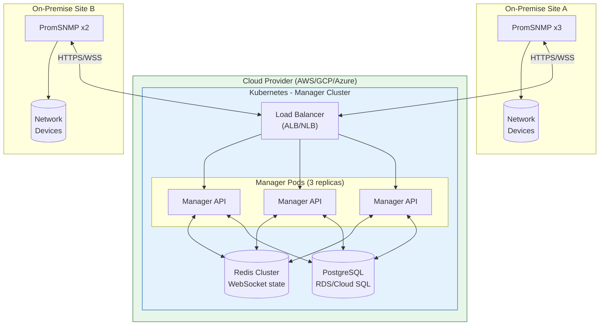

---

## Summary

| Concern | Solution |
|---------|----------|
| **Fault Tolerance** | 3+ replicas with PodDisruptionBudget ensuring min 2 available |
| **State Persistence** | Cloud Manager API (recommended) or shared NFS/EFS volume |
| **Discovery Coordination** | Cloud Manager leader election or external service (Redis/etcd) |
| **Load Balancing** | Kubernetes Service or HAProxy with health checks |
| **Seamless Upgrades** | Rolling updates with maxUnavailable=1, or blue-green deployment |
| **Monitoring** | Prometheus alerts for replica count, leader status, cache efficiency |
| **Recovery** | Automatic pod restart, inventory reload from manager or shared file |
| **Multi-Site** | Cloud Manager provides centralized fleet management |

This architecture provides:
- **99.9%+ availability** with 3 replicas and proper health checks
- **Zero-downtime upgrades** via rolling updates or blue-green deployment
- **Data durability** through Cloud Manager database or encrypted file persistence
- **Coordinated discovery** preventing duplicate network scans
- **Horizontal scalability** by adding more follower instances
- **Fleet-wide visibility** through centralized Cloud Manager dashboard
